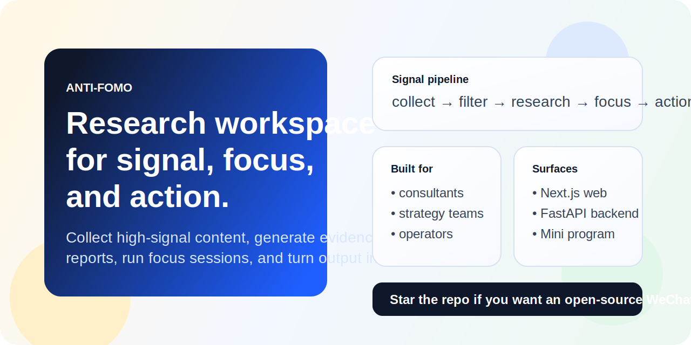

# Anti-FOMO

[English](./README.md) | [简体中文](./README.zh-CN.md)

[](https://nextjs.org/)
[](https://fastapi.tiangolo.com/)
[](./LICENSE)
[](https://github.com/ChrisChen667788/antifomo/stargazers)



Turn noisy web and WeChat signals into evidence-backed research reports, focus sessions, and action-ready follow-up.

Anti-FOMO is an open-source AI research workspace for consultants, founders, BD teams, strategy operators, and builders who need more than read-later apps and generic AI summaries. It closes the loop:

`collect -> clean -> research -> compare -> focus -> action`

Start here:
- [Quick Start](#quick-start)
- [Public roadmap](https://github.com/ChrisChen667788/antifomo/issues/1)
- [Good first issue](https://github.com/ChrisChen667788/antifomo/issues/2)
- [Help wanted: WeChat collection reliability](https://github.com/ChrisChen667788/antifomo/issues/3)
- [GitHub Discussions](https://github.com/ChrisChen667788/antifomo/discussions)
- [Launch kit](./docs/open-source-launch-kit.md)
- [Growth copy kit](./docs/open-source-growth-copy.md)

## Why Anti-FOMO

Most information products stop at one of these layers:

- save later
- summarize
- search
- export notes

Anti-FOMO is built for the whole operating loop:

- collect high-signal inputs from URLs, text, feeds, and WeChat-heavy workflows
- clean noisy evidence and weak source dumps before they pollute downstream output
- generate evidence-aware research reports, compare snapshots, and delivery artifacts
- run focused execution sessions and export follow-up actions
- turn research into action cards, feasibility studies, project proposals, and client-facing outlines

## Why people star it

- `WeChat-first`: not just another generic web clipper; the collection pipeline is designed around WeChat-heavy information environments.
- `Evidence-aware`: report quality, source mix, target-account support, and section-level evidence diagnostics are first-class.
- `Execution-oriented`: focus sessions, action cards, watchlists, briefs, and export tasks are part of the same workspace.
- `Hackable`: local-first Next.js + FastAPI stack with browser extension, miniapp, collector scripts, and a testable backend.

## What you get today

### 1. High-signal intake

- URL, text, RSS, newsletter, file, and YouTube transcript intake
- browser extension quick-send pipeline
- WeChat URL-first collection chain, collector ops, and WeChat PC agent tooling
- focused cleanup rules for screenshot OCR, markdown dumps, awards/forum noise, and weak vendor push pieces

### 2. Research workspace

- keyword research and structured report drafting
- follow-up / second-pass report generation with new evidence and new requirements
- compare workspace, archive history, diff recap, and export chain
- watchlists, daily brief, knowledge intelligence, and commercial-hub context

### 3. Retrieval-backed quality layer

- local research retrieval index with persistent rebuild, resume, and search
- section-level retrieval packs and evidence diagnostics
- quality profile, guarded backlog routing, canonical organization linking, and low-quality rewrite/backfill flows
- market-intelligence packs with three-year tender history, product lists, technical parameters, and delivery outlines

### 4. Execution outputs

- focus sessions and session-summary exports
- action cards, exec brief, sales brief, outreach draft, and watchlist digest
- feasibility study, project proposal, and client PPT outline export chain
- formal document review loop with scenario, target customer, and vertical-scene overrides

## Best for

- consulting and strategy teams
- founders and product leads tracking fast-moving AI markets
- BD / pre-sales / solution teams preparing opportunity research and client materials
- operators who live in WeChat article flows but still need traceable evidence
- developers who want a local-first, modifiable research workspace instead of a black box SaaS

## Quick Start

### 1. One-time setup

```bash
cd /Users/chenhaorui/PyCharmMiscProject/.idea/anti-fomo-demo
npm run demo:setup
```

This installs frontend dependencies, backend Python dependencies, and creates `backend/.env`.

### 2. One-command start

```bash
cd /Users/chenhaorui/PyCharmMiscProject/.idea/anti-fomo-demo
npm run demo:start
```

Open:

- web: `http://localhost:3010`
- backend API: `http://localhost:8000`

Stop all services with:

```bash
npm run demo:stop
```

### 3. Validate the baseline

```bash
cd /Users/chenhaorui/PyCharmMiscProject/.idea/anti-fomo-demo
npm run check
npm run demo:smoke
```

If you want the focus E2E and simulation flows:

```bash
npm run demo:focus-e2e -- --report-file .tmp/focus-e2e-report.json --artifact-dir .tmp/focus-e2e-artifacts
npm run demo:simulate
```

## Main surfaces

- `http://localhost:3010/inbox`: intake, keyword research, report generation, and formal document export
- `http://localhost:3010/research`: research center, topics, compare, archives, and retrieval-backed analysis
- `http://localhost:3010/focus`: execution sessions and session artifacts
- `http://localhost:3010/knowledge`: saved knowledge, accounts, and merge workflows
- `browser-extension/chrome`: quick-send the current page into Anti-FOMO
- `miniapp`: WeChat mini program shell for mobile-side flows
- `scripts/`: collector, watchlist, plugin, and smoke-test operations

## Repository layout

```text
.
├── src/                    # Next.js web app
├── backend/                # FastAPI backend, models, services, tests
├── miniapp/                # WeChat mini program
├── browser-extension/      # Chrome extension
├── scripts/                # collector / automation / smoke helpers
├── docs/                   # roadmap, launch kit, growth copy, assets
└── public/                 # static assets and social preview resources
```

## Current project status

Current code baseline:

- active local-first product prototype
- current version: `0.4.2+20260424`
- web build passes
- backend test suite passes via `npm run check`
- public repository sanitized for open-source release

The public repo intentionally does not include:

- runtime `.env` secrets
- private user data
- local collector logs and screenshots
- personal databases or undeclared paid-source content
- real WeChat mini program production credentials

## Community and launch resources

- product ideas and requests: open a Discussion or issue
- bug reports: include repro steps and logs
- code contributions: see [CONTRIBUTING.md](./CONTRIBUTING.md)
- security reports: see [SECURITY.md](./SECURITY.md)

Built-in launch assets:

- [Launch kit](./docs/open-source-launch-kit.md)
- [Growth copy kit](./docs/open-source-growth-copy.md)
- [Open-source backlog](./docs/open-source-backlog.md)
- [GitHub hero asset](./docs/assets/github-hero.svg)
- [GitHub social preview](./docs/assets/github-social-preview.png)
- [Repo banner](./public/repo-banner.png)

If Anti-FOMO is useful for your workflow, star the repo. That is still the simplest way to help the project reach more users, contributors, and design partners.
