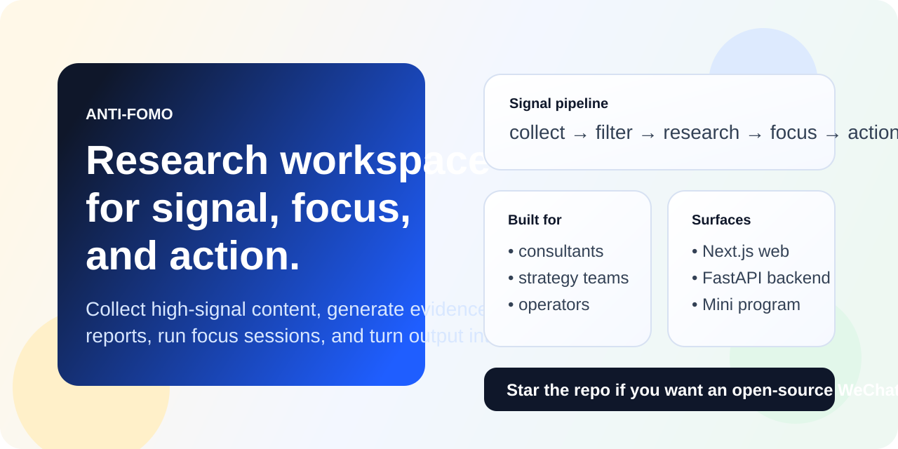
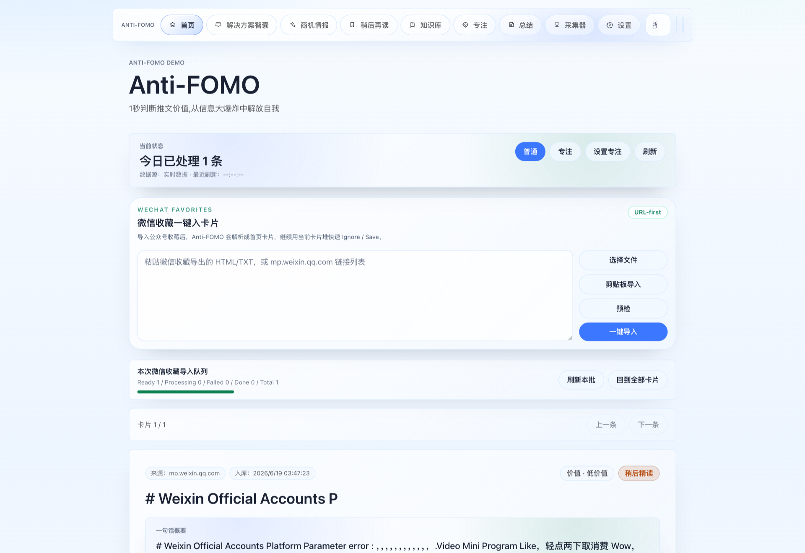
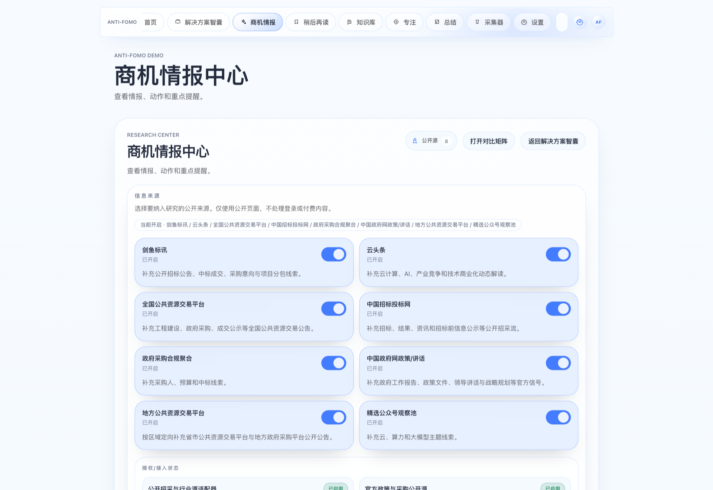
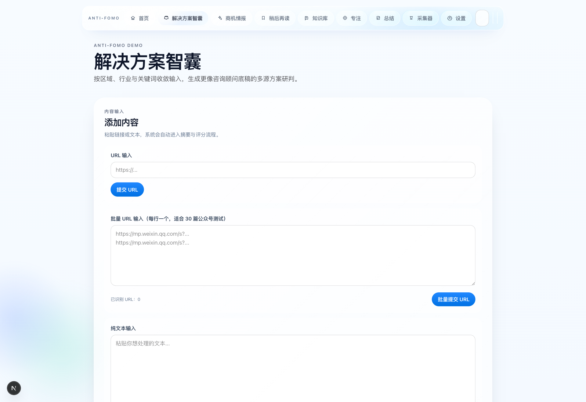
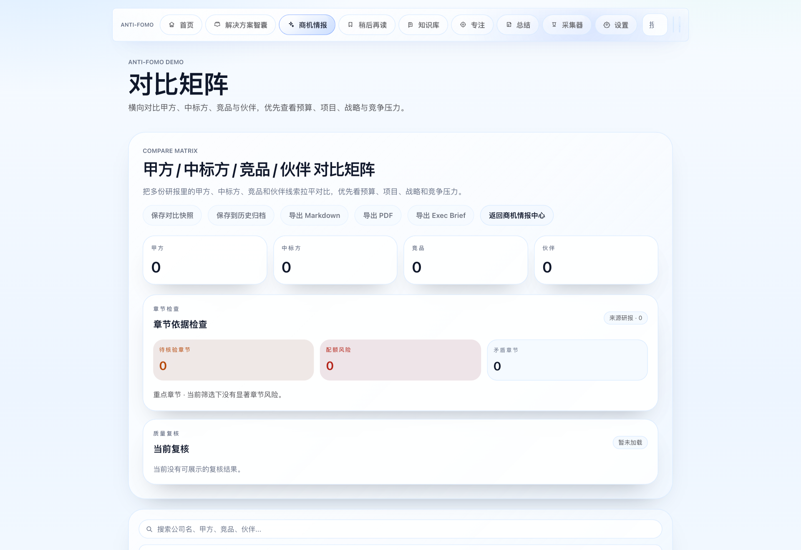
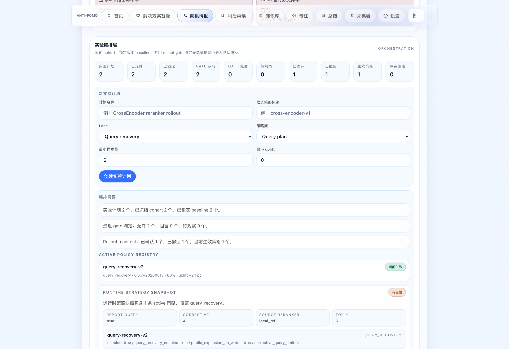
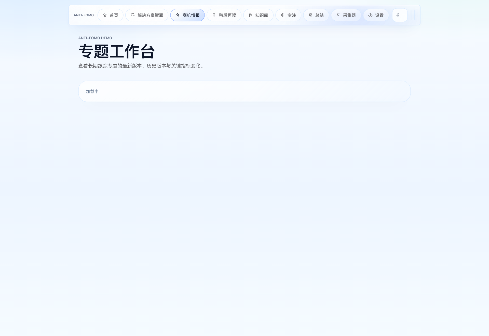
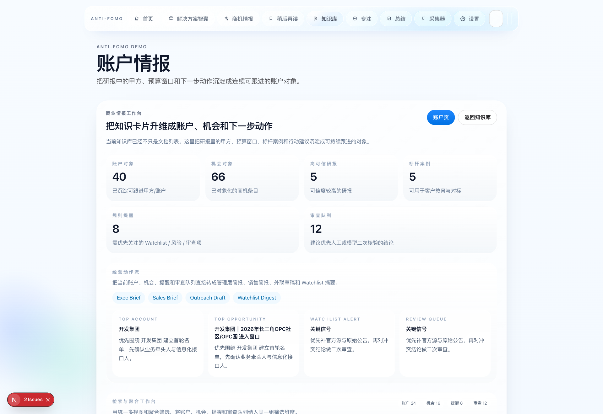
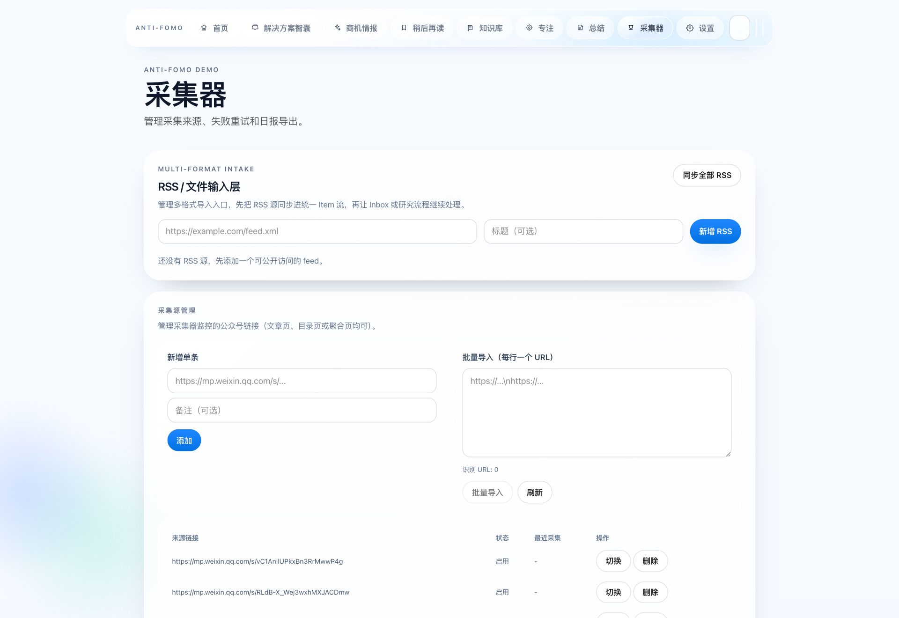

# Anti-FOMO

[English](./README.md) | [简体中文](./README.zh-CN.md)

[](https://nextjs.org/)
[](https://fastapi.tiangolo.com/)
[](./LICENSE)
[](https://github.com/ChrisChen667788/antifomo/stargazers)



Turn noisy web and WeChat signals into evidence-backed research reports, solution architecture blueprints, focus sessions, and action-ready follow-up.

Anti-FOMO is an open-source AI research workspace for solution architects, industry consultants, pre-sales teams, BD teams, strategy operators, and builders who need more than read-later apps and generic AI summaries. It closes the loop:

`collect -> clean -> research -> compare -> focus -> action`

Start here:
- [Quick Start](#quick-start)
- [Public roadmap](https://github.com/ChrisChen667788/antifomo/issues/1)
- [Good first issue](https://github.com/ChrisChen667788/antifomo/issues/2)
- [Help wanted: WeChat collection reliability](https://github.com/ChrisChen667788/antifomo/issues/3)
- [GitHub Discussions](https://github.com/ChrisChen667788/antifomo/discussions)
- [Product whitepaper](./docs/product-whitepaper.md)
- [Launch kit](./docs/open-source-launch-kit.md)
- [Growth copy kit](./docs/open-source-growth-copy.md)

## Why Anti-FOMO

Most information products stop at one of these layers:

- save later
- summarize
- search
- export notes

Anti-FOMO is built for the whole operating loop:

- collect high-signal inputs from URLs, text, feeds, and WeChat-heavy workflows
- clean noisy evidence and weak source dumps before they pollute downstream output
- generate evidence-aware research reports, compare snapshots, solution architecture readiness checks, and delivery artifacts
- run focused execution sessions and export follow-up actions
- turn research into action cards, feasibility studies, project proposals, and client-facing outlines

## Why people star it

- `WeChat-first`: not just another generic web clipper; the collection pipeline is designed around WeChat-heavy information environments, with headless source collection and per-source health diagnostics.
- `Evidence-aware`: report quality, source mix, target-account support, and section-level evidence diagnostics are first-class.
- `Architecture-ready`: solution packs now include architecture readiness scoring, blueprint layers, stakeholder question maps, decision criteria, ADR-style decisions, integration dependency diagnostics, non-functional requirements, and validation actions for solution architects.
- `Execution-oriented`: focus sessions, action cards, watchlists, briefs, and export tasks are part of the same workspace.
- `Hackable`: local-first Next.js + FastAPI stack with browser extension, miniapp, collector scripts, and a testable backend.

## Major Version Highlights

Each public version line below includes both an English product summary and a Chinese capability summary. The deeper release map is maintained in [Release History and Feature Map](./docs/release-history-and-feature-map.md).

| Version line | English core capabilities | 中文核心功能 |
| --- | --- | --- |
| `0.3.x` | Research quality baseline with compare/export, archive snapshots, offline metrics, evidence gates, section evidence packs, and methodology playbooks. | 研究质量基线：稳定对比/导出、历史快照、离线评估、证据门槛、章节证据包和行业方法论。 |
| `0.4.x` | Retrieval substrate and delivery packs with persistent retrieval index, section routing, golden evaluation, tender/product intelligence, and formal export paths. | 检索底座与交付包：持久化检索索引、章节路由、黄金样本评估、招投标/产品情报和正式文档导出。 |
| `0.5.x` | RAG quality engineering with corrective retrieval, grounding review, schema-v2 chunks, source cleaning, entity cleanup, and reranker controls. | RAG 质量工程：纠偏检索、生成 grounding 审查、schema-v2 切块、信源清洗、实体清理和重排控制。 |
| `0.6.0` - `0.6.4` | Reranking, delivery quality, and diagnostics control plane with CrossEncoder support, rebuild visualization, quality scoring, self-repair, A/B controls, and export trend comparison. | 重排、交付质控与诊断控制面：CrossEncoder、重建可视化、质量评分、自修订、A/B 控制和导出趋势对比。 |
| `0.6.5` - `0.6.10` | Persistent experiment orchestration and runtime strategy activation with frozen cohorts, locked baselines, rollout gates, manifests, active policy registry, and effective runtime config. | 实验编排与运行时策略：cohort 固化、baseline 锁定、rollout gate、manifest、生效策略注册表和实际运行配置。 |
| `0.6.11` | Release-grade documentation and screenshot coverage across all primary product surfaces. | 发布级文档与截图覆盖：主功能界面截图、截图质量门槛、manifest 和完整能力地图。 |
| `0.7.0` | Collector reliability release with headless-source-first Focus collection and per-source WeChat health diagnostics. | 采集可靠性版本：Focus 优先启动无头源采集，并展示按公众号源的健康诊断。 |
| `0.8.0` | Solution architecture readiness with scoring, blueprint layers, integration risks, non-functional requirements, stakeholder questions, and validation actions. | 解决方案架构就绪：架构评分、蓝图分层、集成风险、非功能要求、干系人问题和验证动作。 |
| `0.8.1` | WeChat Favorites import with preview, dedupe, persistent batches, queue recovery, failed-item retry, and homepage swipe triage. | 微信收藏导入：预检、去重、批次持久化、队列恢复、失败重试和首页滑动处理。 |
| `0.9.0` | Solution architect workbench with customer scenarios, stakeholder maps, decision criteria, validation actions, next-meeting agendas, and markdown export. | 解决方案架构师工作台：客户场景、干系人地图、决策标准、验证动作、下次会议议程和 Markdown 导出。 |
| `1.0.0` | Local-first WeChat-to-solution baseline connecting intake, triage, evidence-backed research, architecture readiness, workbench outputs, migration coverage, and validation. | 本地优先微信到方案基线：打通采集、首页处理、证据研报、架构就绪、工作台产物、迁移覆盖和验证。 |
| `1.1.0` | Modular architecture and design-system hardening with thinner research workflows, split feature clients/controllers, decomposed report panels, and semantic day/night theme tokens. | 模块化架构与设计系统加固：研究 workflow 变薄、feature client/controller 拆分、研报面板拆组件、日夜模式语义主题 token 收敛。 |
| `1.1.1` | Measurable workflow baseline with framework-neutral orchestration, per-run metrics, a model cost ledger, and a versioned 100-case research evaluation structure. | 可度量工作流基线：框架中立编排、单次运行指标、模型成本账本和版本化 100 条研究评测集结构。 |
| `1.2.0` | LangChain adapter with Pydantic structured output, provider-reported token usage, configurable model pricing, and independent generation/strategy routing. | LangChain 适配层：Pydantic 结构化输出、provider 真实 token usage、可配置模型价格和生成/策略模型独立路由。 |
| `1.2.1` | Runtime hardening with split provider owners, persisted job metrics/cost ledgers, typed observability APIs, CI secret scanning, and corrected Focus E2E port wiring. | 运行时加固：拆分模型 provider owner、持久化任务指标与成本账本、类型化观测 API、CI 密钥扫描及 Focus E2E 端口修复。 |
| `1.3.0` | Executable 100-case research evaluation with honest unavailable metrics, cost-safe provider confirmation, JSON artifacts, and strict release-gate eligibility. | 可执行 100 条研究评测：缺失 gold 指标明确不可用、远程模型成本显式确认、JSON 产物和严格发布门禁。 |
| `1.4.0` | LangGraph shadow orchestration behind the workflow protocol, with deterministic parity metrics, explicit engine selection, and no automatic production dual-run cost. | LangGraph 影子编排：位于工作流协议之后，复用确定性指标、显式选择引擎，且不自动增加生产双跑成本。 |
| `1.5.0` | Hotspot decomposition and UI regression coverage with backend owner splits, frontend model owners, Vitest component/model tests, theme preference regression, and a current Next.js security patch. | 热点拆分与 UI 回归覆盖：后端 owner 拆分、前端 model owner、Vitest 组件/模型测试、主题偏好回归，以及 Next.js 当前安全补丁。 |
| `1.6.0` | Release hardening with shared Focus runtime owners, pre-hydration preferences, deterministic dual-theme screenshots, dark-mode contrast compatibility, and dead facade-wrapper retirement. | 发布加固：共享 Focus 运行时 owner、首屏偏好引导、确定性双主题截图、深色对比度兼容和废弃 facade 包装器清理。 |

## Product screenshots

The full release-grade screenshot coverage is maintained in [Feature Screenshot Coverage](./docs/feature-screenshot-coverage.md), with the historical release capability map in [Release History and Feature Map](./docs/release-history-and-feature-map.md).

<table>
  <tr>
    <td width="50%">
      
      <p><strong>Home signal dashboard</strong><br />Triage noisy signals and move quickly into research, focus, saved knowledge, and operations.</p>
    </td>
    <td width="50%">
      
      <p><strong>Research center</strong><br />Operate watchlists, retrieval health, archives, diagnostics, and delivery quality from one center.</p>
    </td>
  </tr>
  <tr>
    <td width="50%">
      
      <p><strong>Inbox / research workspace</strong><br />Generate reports, refine scenario inputs, review architecture readiness, and export formal delivery documents.</p>
    </td>
    <td width="50%">
      
      <p><strong>Compare workspace</strong><br />Review multi-version differences, section evidence, and account-oriented comparison signals.</p>
    </td>
  </tr>
  <tr>
    <td width="50%">
      
      <p><strong>Experiment control plane</strong><br />Freeze cohorts, lock baselines, audit rollout gates, and inspect effective retrieval and report-generation runtime config.</p>
    </td>
    <td width="50%">
      
      <p><strong>Topic workspace</strong><br />Track topic versions, evidence density, and long-running research changes over time.</p>
    </td>
  </tr>
  <tr>
    <td width="50%">
      
      <p><strong>Knowledge commercial hub</strong><br />Turn reports into account objects, opportunities, review queues, and follow-up actions.</p>
    </td>
    <td width="50%">
      
      <p><strong>Collector operations</strong><br />Manage local collector imports, source health diagnostics, OCR backfill, queue recovery, automation, and daily exports.</p>
    </td>
  </tr>
</table>

## What you get today

### 1. High-signal intake

- URL, text, RSS, newsletter, file, and YouTube transcript intake
- one-click WeChat Favorites preview and import from exported HTML/TXT, `.url` / `.webloc`, multi-file drops, clipboard text, or raw / escaped / encoded `mp.weixin.qq.com` link lists, with deduplication into the homepage triage deck
- a persisted latest WeChat Favorites review queue on the homepage with ready / processing / failed / done counts, one-click retry for failed items, and automatic recovery after reload while background parsing finishes
- browser extension quick-send pipeline
- WeChat URL-first collection chain, headless source collector, collector ops, source-level health diagnostics, and WeChat PC agent supplementary harvesting
- focused cleanup rules for screenshot OCR, markdown dumps, awards/forum noise, and weak vendor push pieces

### 2. Research workspace

- keyword research and structured report drafting
- follow-up / second-pass report generation with new evidence and new requirements
- compare workspace, archive history, diff recap, and export chain
- watchlists, daily brief, knowledge intelligence, and commercial-hub context
- solution architecture readiness scoring for business alignment, capability boundaries, integration dependencies, security/compliance constraints, and delivery feasibility
- a solution architect workbench with customer scenarios, stakeholder concerns, capability-to-architecture mappings, ADR-style decisions, integration dependency diagnostics, validation actions, and next-meeting agendas

### 3. Retrieval-backed quality layer

- local research retrieval index with persistent rebuild, resume, and search
- retrieval-index status panel with resumable rebuild progress and parent-block routing diagnostics
- runtime optimization panel for incremental rebuild, persisted-cache reuse, and recovery guidance
- optional SentenceTransformers CrossEncoder reranker adapter with offline official-source recall evaluation
- query / routing / reranker A/B control-plane views plus follow-up delta offline evaluation
- persistent experiment orchestration for configurable strategy plans, frozen cohorts, locked baselines, gate history, active strategy registry, runtime strategy snapshots, effective retrieval/report-generation config, and auditable rollout manifests
- section-level retrieval packs and evidence diagnostics
- quality profile, guarded backlog routing, canonical organization linking, and low-quality rewrite/backfill flows
- market-intelligence packs with three-year tender history, product lists, technical parameters, and advisory delivery outlines
- China-tech delivery quality review for solution packs and proposal-grade formal materials, including automatic structural self-repair
- offline regression metrics now track solution-delivery pass rate, project-proposal pass rate, and delivery self-review gain rate
- delivery export diagnostics now preserve historical quality trends and adjacent-version comparisons

### 4. Execution outputs

- focus sessions and session-summary exports with hybrid source collector startup during Focus mode
- action cards, exec brief, sales brief, outreach draft, and watchlist digest
- swipeable homepage cards with auto-advance after ignore/save, removing processed items from the active WeChat Favorites batch
- watchlist run history, failed-run retry notes, notification summaries, and Markdown digest export
- feasibility study, project proposal, client PPT outline, client brief, bidding prep memo, and execution-material export chain
- formal document review loop with scenario, target customer, vertical-scene overrides, and delivery-quality audit notes
- architecture blueprint export with business/role, application capability, model/data/integration, and security/deployment/operations layers

## Best for

- solution architects turning noisy market signals into client-ready architecture narratives
- industry consultants preparing evidence-backed opportunity studies and advisory deliverables
- BD / pre-sales / solution teams preparing opportunity research and client materials
- founders and product leads tracking fast-moving AI markets
- operators who live in WeChat article flows but still need traceable evidence
- developers who want a local-first, modifiable research workspace instead of a black box SaaS

## Quick Start

### 1. One-time setup

```bash
cd /Users/chenhaorui/PyCharmMiscProject/.idea/anti-fomo-demo
npm run demo:setup
```

This installs frontend dependencies, backend Python dependencies, and creates `backend/.env`.

### 2. One-command start

```bash
cd /Users/chenhaorui/PyCharmMiscProject/.idea/anti-fomo-demo
npm run demo:start
```

Open:

- web: `http://localhost:3010`
- backend API: `http://localhost:8000`

Stop all services with:

```bash
npm run demo:stop
```

### 3. Validate the baseline

```bash
cd /Users/chenhaorui/PyCharmMiscProject/.idea/anti-fomo-demo
npm run check
npm run demo:smoke
```

If you want the focus E2E and simulation flows:

```bash
npm run demo:focus-e2e -- --report-file .tmp/focus-e2e-report.json --artifact-dir .tmp/focus-e2e-artifacts
npm run demo:simulate
```

## Main surfaces

- `http://localhost:3010/inbox`: intake, keyword research, report generation, and formal document export
- `http://localhost:3010/research`: research center, topics, compare, archives, and retrieval-backed analysis
- `http://localhost:3010/focus`: execution sessions and session artifacts
- `http://localhost:3010/knowledge`: saved knowledge, accounts, and merge workflows
- `browser-extension/chrome`: quick-send the current page into Anti-FOMO
- `miniapp`: WeChat mini program shell for mobile-side flows
- `scripts/`: collector, watchlist, plugin, and smoke-test operations

## Repository layout

```text
.
├── src/                    # Next.js web app
├── backend/                # FastAPI backend, models, services, tests
├── miniapp/                # WeChat mini program
├── browser-extension/      # Chrome extension
├── scripts/                # collector / automation / smoke helpers
├── docs/                   # roadmap, launch kit, growth copy, assets
└── public/                 # static assets and social preview resources
```

## Current project status

Current code baseline:

- active local-first product prototype
- current version: `1.6.0+20260613`
- web build passes
- frontend and backend test suites pass via `npm run check`
- release screenshots cover every primary feature surface through `npm run repo:screenshots`
- major-version history and the latest full feature map are maintained in `docs/release-history-and-feature-map.md`
- product whitepaper and launch copy are maintained in `docs/product-whitepaper.md`, `docs/open-source-launch-kit.md`, and `docs/open-source-growth-copy.md`
- public repository sanitized for open-source release

The public repo intentionally does not include:

- runtime `.env` secrets
- private user data
- local collector logs and screenshots
- personal databases or undeclared paid-source content
- real WeChat mini program production credentials

## Community and launch resources

- product ideas and requests: open a Discussion or issue
- bug reports: include repro steps and logs
- code contributions: see [CONTRIBUTING.md](./CONTRIBUTING.md)
- security reports: see [SECURITY.md](./SECURITY.md)

Built-in launch assets:

- [Launch kit](./docs/open-source-launch-kit.md)
- [Growth copy kit](./docs/open-source-growth-copy.md)
- [Product whitepaper](./docs/product-whitepaper.md)
- [Open-source backlog](./docs/open-source-backlog.md)
- [GitHub hero asset](./docs/assets/github-hero.svg)
- [GitHub social preview](./docs/assets/github-social-preview.png)
- [Repo banner](./public/repo-banner.png)

If Anti-FOMO is useful for your workflow, star the repo. That is still the simplest way to help the project reach more users, contributors, and design partners.
