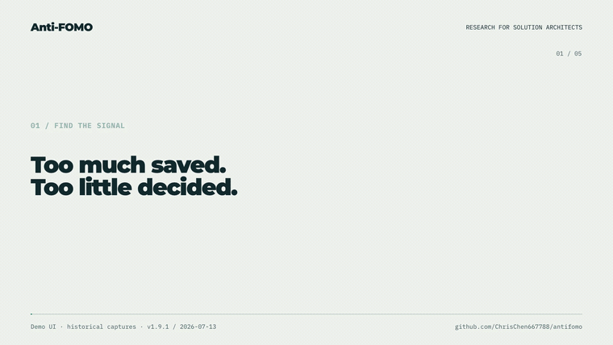
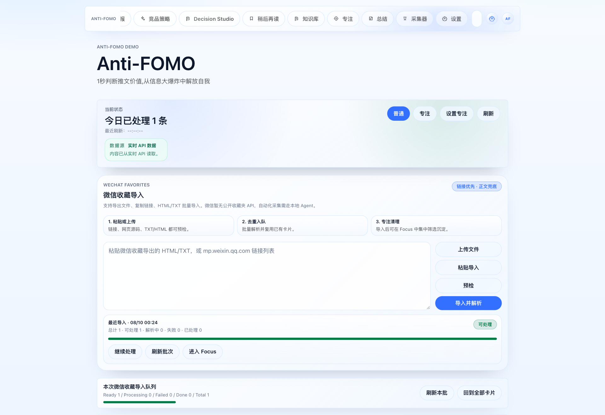
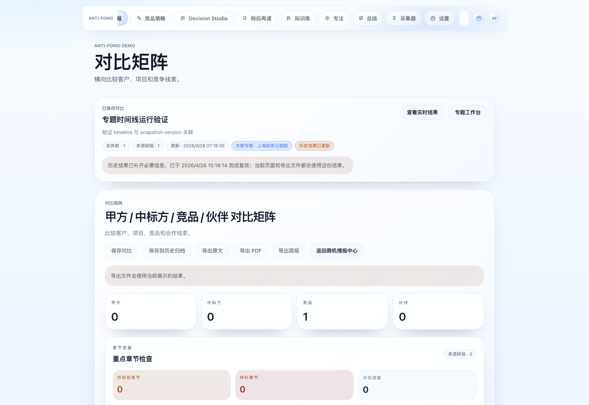
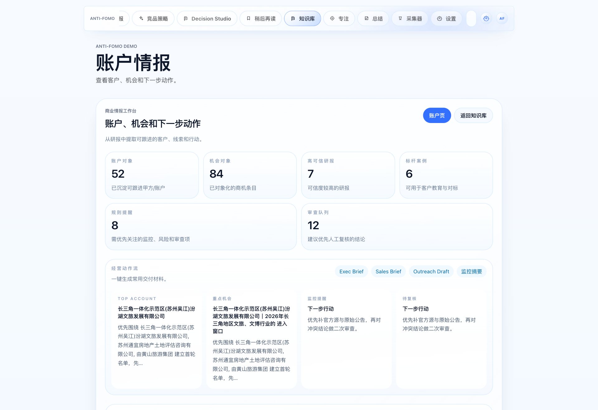
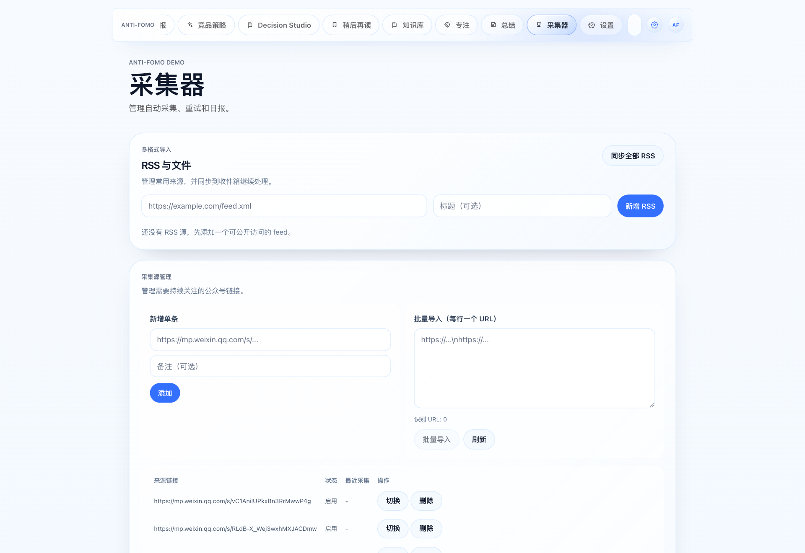
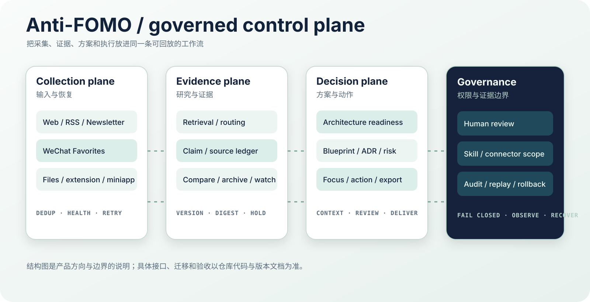
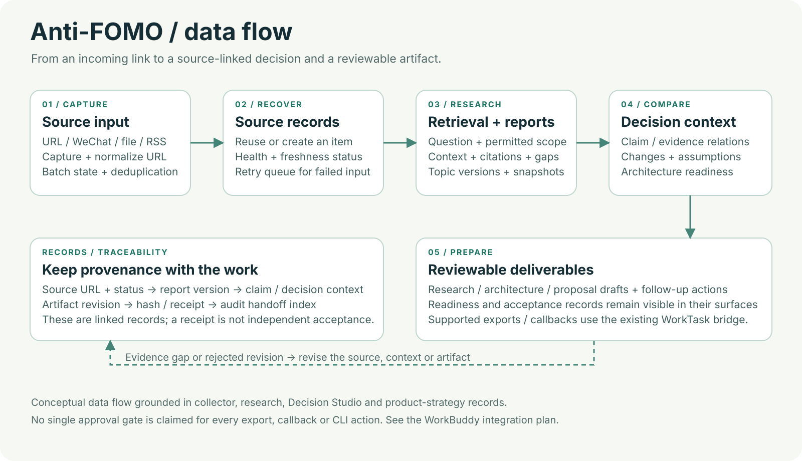
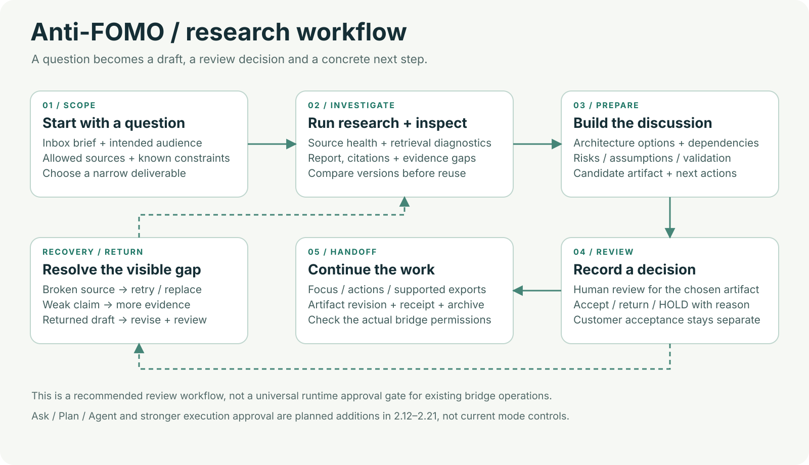

# Anti-FOMO

[English](./README.md) · [简体中文](./README.zh-CN.md)

<p align="center">
  
</p>

**Turn the links you saved into a decision you can explain.**

Anti-FOMO is an open-source research and solution workbench for consultants, solution architects, and pre-sales teams. Bring in web pages, WeChat articles, and files; follow the evidence into a research draft, architecture discussion, and concrete next step.

[](./LICENSE)
[](https://github.com/ChrisChen667788/antifomo/actions/workflows/ci.yml)
[](./package.json)
[](./backend/README.md)
[](https://github.com/ChrisChen667788/antifomo/stargazers)

[Quick Start](#quick-start) · [Product tour](#product-tour) · [Architecture](#how-it-fits-together) · [WorkBuddy comparison](./docs/workbuddy-deep-dive-2026-09-18.md) · [Roadmap](./docs/public-roadmap.md)

> **Current status:** a local-first development prototype. The active development line, evidence coverage, and remaining acceptance work are recorded in [Current Product Status](./docs/current-product-status.md). Public customer ROI and production service commitments are not established.

## The work it helps you finish

You saved an article because it might matter to a customer. Before the next meeting, you still need to answer: **what changed, what supports that conclusion, and what should we do next?**

Anti-FOMO keeps that work connected:

`Collect → Check sources → Research → Compare → Prepare a decision → Follow up`

| Your task | Bring in | Take into the next conversation |
| --- | --- | --- |
| Prepare a customer solution workshop | Customer context, public evidence, known constraints | A research draft, architecture options, integration risks, and questions to validate |
| Decide which tender or account to investigate | Procurement notices, policies, industry and account signals | Source-linked opportunity context, missing facts, and follow-up actions |
| Keep a competitor brief current | Official product pages and a watchlist | Dated changes, stale-source warnings, and a reviewable product decision |

The aim is less time reconstructing context and a clearer handoff between research and delivery. Those business gains are **pilot hypotheses to measure**, not advertised results. See the [value and measurement map](./docs/value-map.md).

## Product tour

<p align="center">
  <a href="./docs/assets/marketing/antifomo-overview.mp4">
    
  </a>
</p>

[Watch the 15-second silent overview](./docs/assets/marketing/antifomo-overview.mp4) · [Poster](./docs/assets/marketing/poster.png) · [Demo script and asset provenance](./docs/marketing/DEMO-SCRIPT.md)

The overview is a montage of historical v1.9.1 local demo screenshots. Its motion and captions explain the product story; they do not record a current end-to-end run or prove release acceptance. The opening lens artwork is a brand illustration.

### 1. Give the collection backlog a next step

Import WeChat Favorites from exported files or links, preview and deduplicate the batch, then save or dismiss items in the homepage queue. Failed items and collector source health remain visible so you know what needs another attempt.

### 2. Keep the answer connected to its sources

Scope a research question, inspect source and retrieval diagnostics, and revisit the report through topic history and comparison. Missing evidence becomes a visible gap to investigate. Architecture outputs carry assumptions, dependencies, decision criteria, and validation actions into the next discussion.

### 3. Leave with something you can review

Prepare research documents, solution outlines, feasibility-study or proposal drafts, action cards, and Focus summaries. Decision Studio and the product-strategy workspace add source revisions, artifact differences, and review records. File export and customer approval are separate outcomes.

<table>
  <tr>
    <td width="50%"><br /><strong>A manageable intake queue</strong><br />Preview, deduplicate, save, and return to unfinished items.</td>
    <td width="50%"><br /><strong>See what changed</strong><br />Compare research versions before carrying conclusions forward.</td>
  </tr>
  <tr>
    <td width="50%"><br /><strong>Prepare account follow-up</strong><br />Bring research into opportunity context and the next conversation.</td>
    <td width="50%"><br /><strong>Find the broken source</strong><br />Review collection health and recovery guidance by source.</td>
  </tr>
</table>

These four images come from the current [34-image local browser capture](./docs/assets/screenshots/screenshot-manifest.json), generated from source commit `10b536c` with an isolated database copy. Automated browser diagnostics passed; attributable human visual acceptance remains pending. The [screenshot gallery](./docs/feature-screenshot-coverage.md) and [current status](./docs/current-product-status.md) retain the full capture scope and limitations.

## How it fits together

The web app uses Next.js and TypeScript; FastAPI owns collection, research, knowledge, tasks, and delivery. The local demo uses SQLite. A framework-neutral research workflow supports LangGraph orchestration and a deterministic rollback engine.

<p align="center"></p>

[Architecture source](./docs/diagrams/architecture.mmd) · [Surface and code map](./docs/product-surface-map.md)

<p align="center"></p>

<p align="center"></p>

The diagrams describe current code and data boundaries, with future execution controls labeled as planned. They are not live telemetry. [Data-flow source](./docs/diagrams/dataflow.mmd) · [Workflow source](./docs/diagrams/research-delivery.mmd).

**A practical integration detail:** the existing WorkBuddy-compatible webhook can execute supported export tasks and send configured callbacks. Signature verification is bypassed when no webhook secret is configured. Focus delegation can invoke an installed CodeBuddy CLI. These legacy paths are not covered by a universal human-approval gate and do not establish native Tencent WorkBuddy interoperability. The [integration plan](./docs/workbuddy-integration-plan-2026-09-18.md) addresses that boundary before extending it.

## What makes it useful in this field

- **Chinese business inputs:** WeChat-heavy intake, public procurement and policy signals, plus account-oriented research context.
- **Reviewable reasoning:** source versions, evidence gaps, report comparisons, and artifact lineage help a reviewer inspect the work.
- **Solution preparation:** architecture options, stakeholder questions, dependencies, and validation actions bridge research and consulting delivery.
- **An inspectable implementation:** local data, replaceable model configuration, and code ownership that contributors can follow.

WorkBuddy's broad office execution and Anti-FOMO's specialized evidence-to-decision workflow have different strengths. Read the [dated, source-backed comparison](./docs/workbuddy-deep-dive-2026-09-18.md) and [concrete implementation plan](./docs/workbuddy-integration-plan-2026-09-18.md) for the trade-offs and proposed additions.

## Quick Start

Prerequisites: **Node.js 20+** and **Python 3.11**, with `python3.11` available on your path.

```bash
git clone https://github.com/ChrisChen667788/antifomo.git
cd antifomo
npm run demo:setup
npm run demo:start
```

Open the web app at **http://localhost:3010** and the backend at **http://localhost:8000**. Setup installs dependencies and creates `backend/.env` if it is missing.

The example configuration uses a mock main LLM. Full research, optional embeddings, strategy models, and external services have separate configuration requirements; see [backend setup](./backend/README.md) and [the environment example](./backend/.env.example). A successful local start does not mean those services are connected.

Try a small public or synthetic example first:

1. Open `/inbox` and add a link or text you are allowed to use.
2. Inspect the item and its source status; save useful material into the workspace.
3. Configure research providers, then run a narrowly scoped question and inspect the gaps before exporting.
4. Explore `/research`, `/knowledge/accounts`, `/studio`, and `/competitive` for the related review surfaces.

```bash
npm run demo:stop        # Stop the local services
npm run check            # Lint, tests, monitor checks, and build
npm run demo:smoke       # API smoke check; backend must be running
```

The [browser extension](./browser-extension/README.md), [Mini Program](./miniapp/README.md), and [collector documentation](./docs/product-surface-map.md) provide additional entry points.

## Evidence you can inspect

| Evidence | What it supports | What it does not establish |
| --- | --- | --- |
| [CI and tests](https://github.com/ChrisChen667788/antifomo/actions/workflows/ci.yml) | Repeatable code checks on the referenced commit | Customer acceptance or production uptime |
| [Collector benchmark](./docs/wechat-collector-reliability-benchmark.md) | Deduplication behavior on a small deterministic synthetic set | Live WeChat success rate or business time saved |
| [Browser capture manifest](./docs/assets/competitive-evidence/competitive-evidence-manifest.json) | Dated local browser and simulated mobile-viewport observations | Physical-device coverage or a production SLA |
| [Office evidence receipts](./docs/office-evidence-receipts-v2.10.5.md) | File, revision, and render traceability | Independent content or customer sign-off |

For pilot design, success metrics, and the difference between a target and a measured result, read the [product whitepaper](./docs/product-whitepaper.md) and [value map](./docs/value-map.md).

## Build with us

Useful contributions start with a real point of friction: a source that fails, an unclear citation, a difficult export, or a step that takes too much effort. Include a small reproducible example and the result you expected.

- [Contributing](./CONTRIBUTING.md) · [Open issues](https://github.com/ChrisChen667788/antifomo/issues) · [Discussions](https://github.com/ChrisChen667788/antifomo/discussions)
- [Public roadmap](./docs/public-roadmap.md) · [Contributor backlog](./docs/open-source-backlog.md)
- [Launch assets](./docs/open-source-launch-kit.md) · [Copy for sharing](./docs/open-source-growth-copy.md)
- [Release and feature history](./docs/release-history-and-feature-map.md) · [Security reports](./SECURITY.md)

Remove private source material, tokens, local databases, and customer identifiers from public contributions. The project is [MIT licensed](./LICENSE).

If this is a problem you work on, try one small task and tell us where the handoff breaks. A reproducible issue or a focused PR is particularly useful.

## Star History

<a href="https://www.star-history.com/?repos=ChrisChen667788%2Fantifomo&amp;type=date">
  <picture>
    <source media="(prefers-color-scheme: dark)" srcset="https://api.star-history.com/svg?repos=ChrisChen667788/antifomo&amp;type=Date&amp;theme=dark" />
    <source media="(prefers-color-scheme: light)" srcset="https://api.star-history.com/svg?repos=ChrisChen667788/antifomo&amp;type=Date" />
    
  </picture>
</a>

The chart is supplied by Star History; its availability and refresh timing depend on that service.
