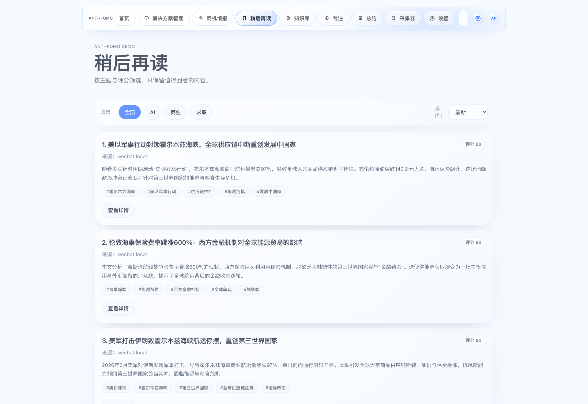
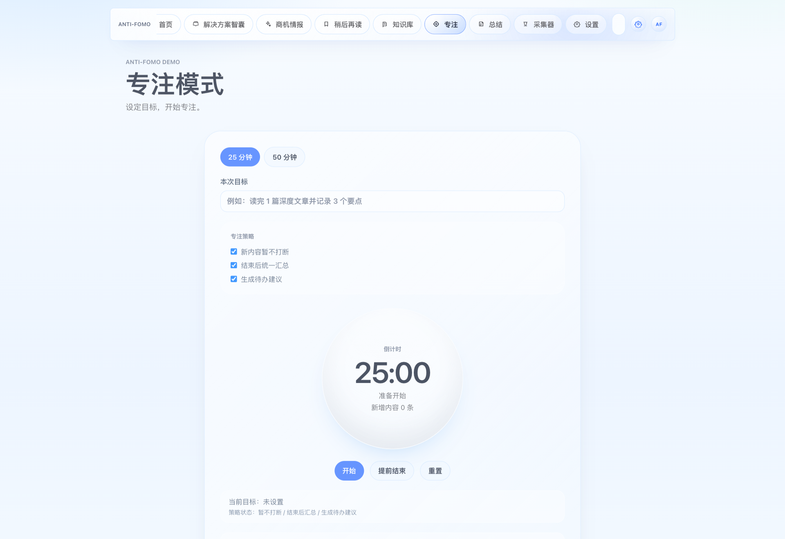
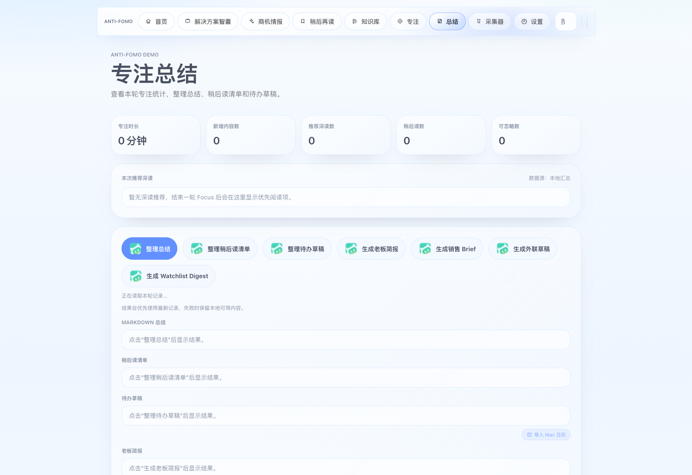
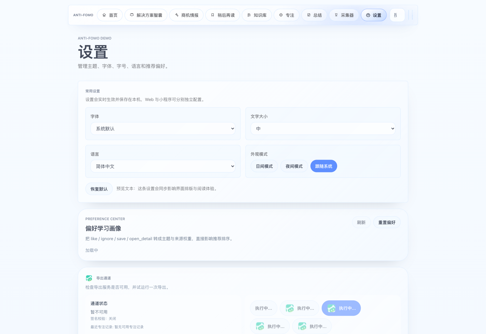
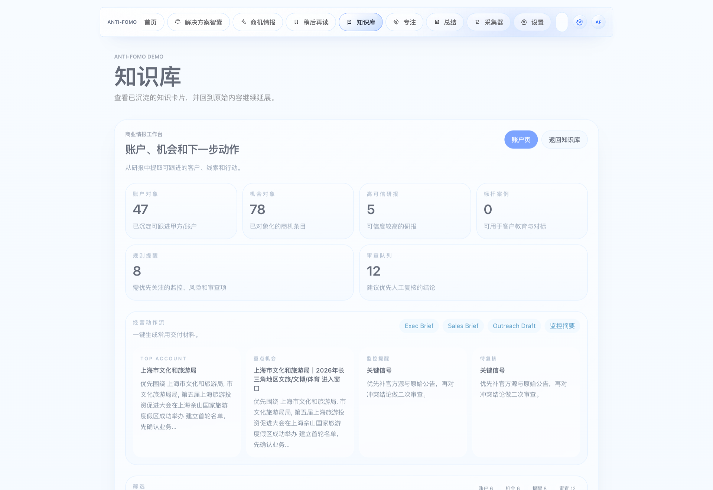
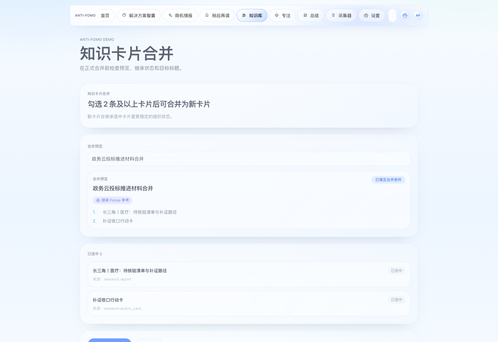
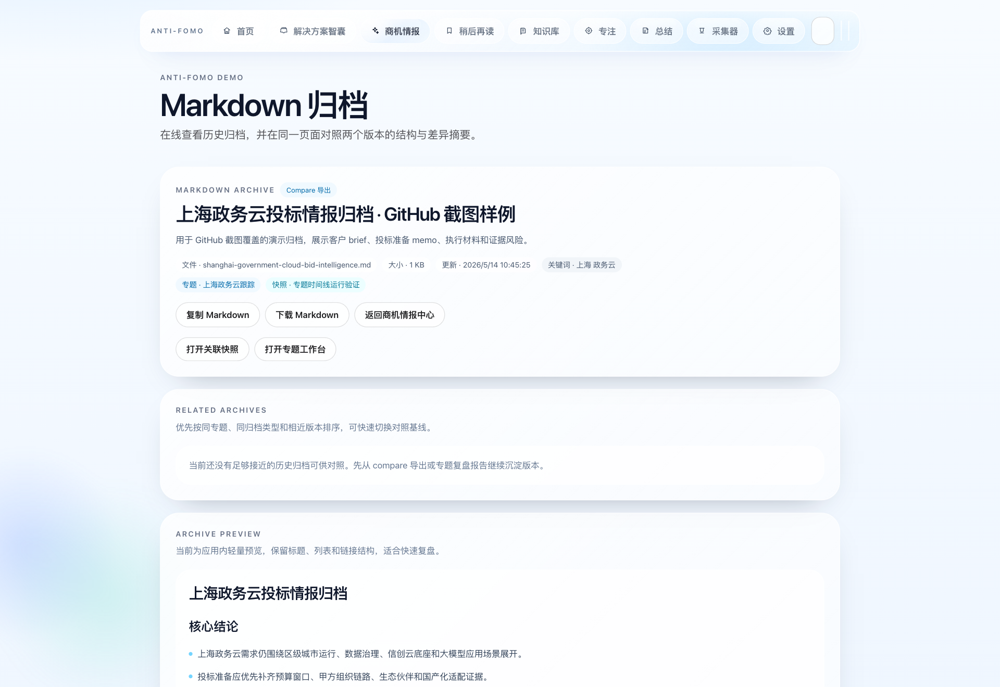

# Feature Screenshot Coverage

Version: `1.2.0+20260613`

This gallery is the release checklist for GitHub-facing product screenshots. Each primary product surface must have at least one current, content-bearing screenshot before a release is pushed.

Refresh and validate the full set with:

```bash
npm run repo:screenshots
```

The capture script also writes `docs/assets/screenshots/screenshot-manifest.json` and rejects screenshots that are too small or captured with a runtime error overlay.

## Coverage Matrix

| Surface | Screenshot | Release note |
| --- | --- | --- |
| Home signal dashboard | `docs/assets/screenshots/home-signal-dashboard.png` | First-screen signal triage, WeChat Favorites import entry, and route switching. |
| Inbox / research workspace | `docs/assets/screenshots/inbox-research-workspace.png` | Intake, report generation, scenario refinement, architecture readiness, architect workbench review, and formal export. |
| Saved / read-later workspace | `docs/assets/screenshots/saved-readlater-workspace.png` | Saved-item review with topic and score context. |
| Focus session workspace | `docs/assets/screenshots/focus-session-workspace.png` | Bounded focus session with headless-source-first collection startup and WeChat PC supplementary URL harvesting. |
| Session summary workspace | `docs/assets/screenshots/session-summary-workspace.png` | Session metrics, markdown summary, reading list, and follow-up drafts. |
| Collector operations workspace | `docs/assets/screenshots/collector-operations-workspace.png` | Desktop collector, source health diagnostics, coverage/body-success rates, OCR backfill, pending queue, and daily export operations. |
| Settings and tuning workspace | `docs/assets/screenshots/settings-tuning-workspace.png` | Preferences, WorkBuddy, collector, and recommender controls. |
| Knowledge library workspace | `docs/assets/screenshots/knowledge-library-workspace.png` | Knowledge list, commercial dashboard, saved intelligence, and review signals. |
| Knowledge commercial hub | `docs/assets/screenshots/knowledge-commercial-hub.png` | Account intelligence, opportunities, review queue, and follow-up actions. |
| Knowledge merge workflow | `docs/assets/screenshots/knowledge-merge-workflow.png` | Merge preview, inherited state checks, and target-title workflow. |
| Research center dashboard | `docs/assets/screenshots/research-center-dashboard.png` | Watchlists, archive entry points, retrieval health, solution architecture readiness, and delivery diagnostics. |
| Research topic workspace | `docs/assets/screenshots/research-topic-workspace.png` | Topic versions, evidence density, follow-up impact, and change tracking. |
| Research compare workspace | `docs/assets/screenshots/research-compare-workspace.png` | Version comparison, account signals, competitor deltas, and export context. |
| Research experiment orchestration | `docs/assets/screenshots/research-experiment-control-plane.png` | Cohorts, baselines, rollout gates, manifests, and runtime policy diagnostics. |
| Research archive viewer | `docs/assets/screenshots/research-archive-viewer.png` | Historical markdown archive, delivery digest, section links, and version context. |

## Gallery

<table>
  <tr>
    <td width="50%">
      
      <p><strong>Home signal dashboard</strong></p>
    </td>
    <td width="50%">
      
      <p><strong>Inbox / research workspace</strong></p>
    </td>
  </tr>
  <tr>
    <td width="50%">
      
      <p><strong>Saved / read-later workspace</strong></p>
    </td>
    <td width="50%">
      
      <p><strong>Focus session workspace</strong></p>
    </td>
  </tr>
  <tr>
    <td width="50%">
      
      <p><strong>Session summary workspace</strong></p>
    </td>
    <td width="50%">
      
      <p><strong>Collector operations workspace</strong></p>
    </td>
  </tr>
  <tr>
    <td width="50%">
      
      <p><strong>Settings and tuning workspace</strong></p>
    </td>
    <td width="50%">
      
      <p><strong>Knowledge library workspace</strong></p>
    </td>
  </tr>
  <tr>
    <td width="50%">
      
      <p><strong>Knowledge commercial hub</strong></p>
    </td>
    <td width="50%">
      
      <p><strong>Knowledge merge workflow</strong></p>
    </td>
  </tr>
  <tr>
    <td width="50%">
      
      <p><strong>Research center dashboard</strong></p>
    </td>
    <td width="50%">
      
      <p><strong>Research topic workspace</strong></p>
    </td>
  </tr>
  <tr>
    <td width="50%">
      
      <p><strong>Research compare workspace</strong></p>
    </td>
    <td width="50%">
      
      <p><strong>Research experiment orchestration</strong></p>
    </td>
  </tr>
  <tr>
    <td width="50%">
      
      <p><strong>Research archive viewer</strong></p>
    </td>
    <td width="50%"></td>
  </tr>
</table>

## Screenshot Acceptance Rules

- Every primary navigation surface must have a current screenshot.
- Every screenshot must be captured from the local product, not a mockup.
- Screenshots with runtime overlays, blank panels, obviously empty critical content, or weak demo content should be discarded and recaptured after improving the demo state.
- Release screenshots should favor surfaces that show evidence, diagnostics, deliverables, or operating controls rather than empty setup states.
- The manifest must match the version being released.
