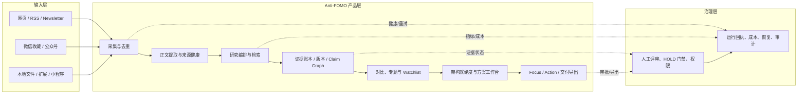
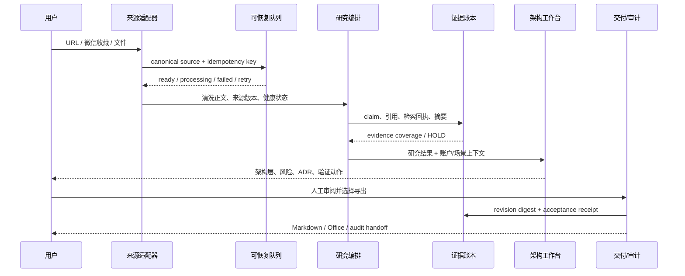
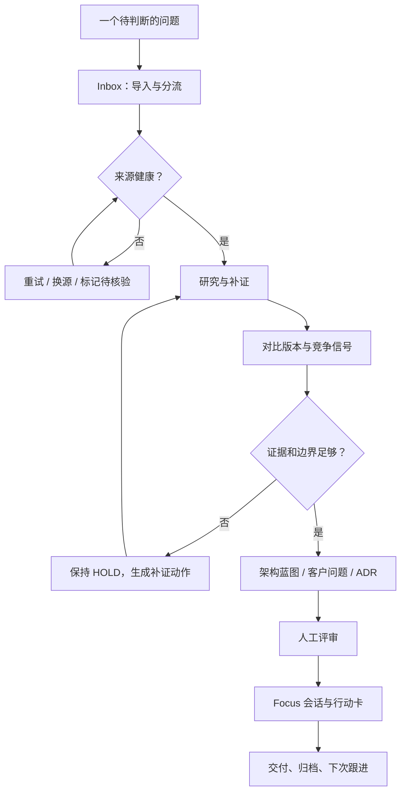

# Anti-FOMO 营销与产品叙事翻修方案（2026-09）

> 这份文档负责 Anti-FOMO 的营销叙事与物料设计，把 WindComic 中“真实工作流 + 有节奏的动效 + 可复核交付”的方法迁移到研究/方案架构场景。竞品事实与 2026-09-22 重点复核记录由 [WorkBuddy 深度对标](./workbuddy-deep-dive-2026-09-18.md) 维护；后续十版工程合同由 [集成计划](./workbuddy-integration-plan-2026-09-18.md) 维护。所有“已具备”“可演示”“待建设”按仓库代码、测试或外部验收分别标注。

## 1. 新的产品叙事

### 一句话

**Anti-FOMO 把网页、微信和本地资料里的噪声，变成有证据的判断、可讨论的方案和下一步动作。**

### 给人的感觉

用户每天真正需要的不是“再读一篇摘要”，而是三件事：

1. **知道什么值得看**：把高信号来源、历史变化、来源健康和重复信息放在一起。
2. **知道哪些结论站得住**：每个重要判断都能回到来源、版本、检索状态和审阅记录。
3. **知道下一步怎么推进**：把研究变成架构蓝图、客户问题、验证动作、会议议程和可交付文件。

新的宣传主张是：

```text
从信息焦虑，到有据可循的判断。
Collect → Research → Compare → Focus → Act
```

它不承诺“自动替你做完所有工作”，而是强调**减少寻找、核对和重新整理的摩擦，同时把人工判断放在正确的位置**。

### 面向不同角色的价值

| 角色 | 一句话价值 | 可展示的结果 | 不应夸大的部分 |
| --- | --- | --- | --- |
| 解决方案架构师 / 售前 | 把市场信号快速推进成客户可讨论的方案 | 架构就绪度、能力矩阵、ADR、集成风险、验证动作、会议议程 | 不宣称替代客户调研、评审或投标决策 |
| 行业咨询顾问 | 把来源、版本和证据组织成可以复核的研究包 | 章节证据包、对比快照、历史变化、正式文档 | 不宣称所有外部来源都实时可用 |
| BD / 产品负责人 | 从信号中筛出账户和动作，而不是只看趋势 | Watchlist、账户情报、行动卡、下一次跟进 | 不把机会评分写成成交预测 |
| 开源贡献者 | 能在本地复现、扩展和检查一条完整工作流 | Next.js + FastAPI、脚本、测试、证据门禁 | 不把本地 Demo 写成生产 SLA |

## 2. 从 WindComic 迁移的宣传方法

WindComic 的可迁移方法是“让观众看到工作被推进”，而不是堆功能名：

- **先给一个真实烦恼**：微信收藏越来越多，但会后仍回答不了客户问题。
- **再展示一条连续动作**：采集 → 清洗 → 证据检索 → 对比 → 架构 → 下一步。
- **每个镜头只讲一个状态变化**：来源进入队列、证据被固定、架构风险显现、动作卡生成。
- **把有生命力的细节留给 UI**：队列数字变化、来源健康颜色、HOLD 门禁、审阅者签名、可重放任务。
- **最后落到可检查的交付物**：Markdown、DOCX/PPTX/PDF、架构蓝图、议程和审计包。

这套方法不复制 WindComic 的角色、品牌、素材或文案，只借鉴其**镜头节奏、状态叙事、资产分层和“从输入到成片/交付”的连续感**。

### 待拍摄：30 秒连续工作流分镜（planned）

下表是后续实机演示的拍摄方案，尚未作为 30 秒成片交付。当前随仓库提供的是 **15 秒无声界面蒙太奇**，使用已有历史 UI 截图，展示页面与使用场景，不证明一次真实任务按镜头顺序执行。已交付 [MP4](./assets/marketing/antifomo-overview.mp4)、[GIF](./assets/marketing/antifomo-overview.gif) 的来源与边界由 [manifest](./assets/marketing/manifest.json) 记录。

| 时间 | 镜头 | 屏幕文案 | 动效与验收 |
| --- | --- | --- | --- |
| 0–3s | 微信、网页、文件碎片进入画面 | `信息很多，不等于判断更快` | 3 类来源以不同速度进入；不出现虚构数字 |
| 3–7s | 去重、正文提取和来源健康 | `先看来源，再看结论` | 重复卡片合并；失败源进入 `watch`，不被隐藏 |
| 7–12s | 证据透镜与章节证据包 | `每个关键判断，都能回到证据` | 引用点连到来源版本；缺证据的字段保持 `HOLD` |
| 12–17s | Compare 与历史快照 | `变化要能解释` | 两个版本左右对照，突出新增、删除和待核验 |
| 17–23s | 架构就绪度与风险矩阵 | `从研究推进到方案` | 业务、能力、数据/模型、部署四层依次亮起 |
| 23–27s | Focus / Action 卡 | `下一步，有边界地执行` | 生成验证动作、客户问题和会议议程；要求人工确认 |
| 27–30s | 产品名、链接、贡献入口 | `Anti-FOMO · Collect / Research / Compare / Act` | Logo 与仓库链接淡入，保留“本地 Demo / 证据门禁”小字 |

动效资产规范见：[Anti-FOMO signal loop SVG](./assets/antifomo-signal-loop.svg)、[GIF preview](./assets/antifomo-signal-loop.gif) 和 [Control-plane architecture](./assets/antifomo-control-plane.svg)。连接点和流动线是品牌演示，不代表线上吞吐或实时状态；README 截图仍使用真实界面截图。

## 3. 视觉与文档系统

### 视觉方向

- **主色**：矿物白背景、深海军蓝文字、低饱和青绿作为唯一强调色，少量金属色只用于“证据固定”提示。
- **构图**：左侧是人的问题和一句话价值，右侧是信息通过“证据透镜”后形成的结构化结果；避免通用 AI 紫蓝渐变、机器人、假仪表盘。
- **文字**：大标题只说一个结果，二级文字解释边界；性能和验收数据只在证据表中出现。
- **形状**：输入是碎片/来源点，研究是层叠纸张/引用线，方案是有层级的蓝图，动作是带审批状态的卡片。
- **动效**：快进只用于来源进入和状态切换；证据固定、人工审批和 HOLD 要有明显停顿，体现产品的可信度。

### 文档分层

| 层 | 读者问题 | 文档/素材 | 更新规则 |
| --- | --- | --- | --- |
| 入口层 | 这是什么、我为什么要试 | README、GitHub hero、30 秒 GIF、开源宣发文案 | 功能叙事变化时更新 |
| 体验层 | 我能看到什么工作流 | 产品截图、动图分镜、产品界面地图、Quick Start | 页面或路径变化时更新 |
| 可信层 | 为什么可以相信结果 | 证据门禁、评测、Office/视觉回执、稳定性报告 | 每次证据运行生成摘要 |
| 决策层 | 是否适合我的团队 | 白皮书、WorkBuddy 对比、商业化路线、NFR | 竞品或路线变化时更新 |
| 贡献层 | 我怎样参与 | CONTRIBUTING、开放 backlog、Issue/PR 模板 | 每个迭代列车同步 |

### README 首屏规则

1. 先放一句话价值和 4 个动词，不在首屏塞版本历史。
2. 主视觉明确标注“概念宣传图”，真实截图独立展示。
3. 在截图前放一条 30 秒闭环：`采集 → 证据 → 对比 → 方案 → 动作`。
4. 让读者在 60 秒内找到 Quick Start、产品边界、路线图和贡献入口。
5. 任何性能数字都必须链接到可复现报告，并注明本地样本/生产 SLA/人工验收的差别。

## 4. 产品架构、数据流与工作流

以下为产品概念图，帮助解释界面与证据的关系，不是逐接口调用轨迹。人工导出、acceptance receipt 和架构工作台可以分别存在；图中的连线不表示现有所有导出 API 已受统一审批控制。当前 webhook 的直接执行边界见第 5 节，统一信封与执行门禁属于 2.12.0 之后的计划。

### 4.1 产品架构图



### 4.2 数据流



### 4.3 用户工作流



## 5. 与 WorkBuddy 的垂直对比

### 5.1 研究范围与证据边界

本节只使用公开的一手资料。WorkBuddy 官方 Quick Start 将其定位为“全场景 AI Agent 桌面工作台”，重点能力是自然语言下达任务、自主规划与执行、并行任务、本地文件操作和可验收成果；官方产品介绍还列出多模态任务、模型切换、MCP、Skills 和高危指令拦截。[官方 Quick Start](https://www.workbuddy.ai/docs/workbuddy/Quickstart)、[官方产品介绍](https://www.codebuddy.cn/docs/workbuddy/From-Beginner-to-Expert-Guide/Product-Guide)

腾讯官方产品页强调 WorkBuddy 连接腾讯生态，并覆盖日常办公、代码开发和设计创意。[腾讯云产品页](https://intl.cloud.tencent.com/zh/products/workbuddy) 企业版资料进一步列出统一身份、安全操作审计、OpenAPI、连接器、企业 Skill/专家和 Managed Agents。[WorkBuddy Enterprise](https://cloud.tencent.com/product/workbuddy-enterprise)

Buddy App 已提供工作模式、场景胶囊、模型、能力市场与已有系统集成等行业定制入口，因此 WorkBuddy 能直接进入招投标、售前和行业研究。Anti-FOMO 的证据链差异需要同任务评测，不能用“通用办公”推断它没有垂直能力。[Buddy App 官方说明](https://open.workbuddy.cn/docs/buddy-app) 完整双向比较、T1/T2/T3 协议和来源有效期见 [深度对标报告](./workbuddy-deep-dive-2026-09-18.md)。

| 维度 | Anti-FOMO | WorkBuddy | 判断 |
| --- | --- | --- | --- |
| 产品抽象 | 证据感知的研究与方案工作台 | 全场景桌面 AI Agent 工作台 | 两者在“工作台”相交，但主问题不同 |
| 输入 | 微信优先、网页、RSS、文件、扩展、小程序 | 自然语言、授权本地文件、联网、腾讯生态和开放连接器 | Anti-FOMO 的微信采集链更垂直；WorkBuddy 的入口更泛化 |
| 规划与执行 | 研究编排、可恢复队列、Focus 与人工确认 | Agent / Plan / Ask 模式、一句话任务、自主拆解、多任务并行、直接操作文件 | Anti-FOMO 应吸收“先计划再执行”的体验，而不是放开任意副作用 |
| 研究质量 | 来源版本、Claim/Evidence、检索诊断、HOLD、审阅和审计交接 | 官方资料明确有深度研究与结果交付；没有在公开 Quick Start 中核验同等粒度的证据账本 | Anti-FOMO 的差异化应继续放在可追溯判断 |
| 方案交付 | 架构就绪度、四层蓝图、ADR、集成风险、客户问题和验证动作 | 文档/表格/PPT/网页交付，Buddy App/Expert/Skill 可配置行业工作台 | Anti-FOMO 更聚焦方案证据；WorkBuddy 产物与行业配置面更广，质量优劣待 T2 评测 |
| 生态连接 | 本地适配器、浏览器扩展、小程序、受控 connector 方向 | 腾讯文档/会议/企微/QQ 等原生连接器，开放平台提供 Buddy、专家、Skill、连接器和硬件生态 | 应优先兼容开放连接器协议，避免复制腾讯生态 |
| 团队与知识 | Claim Graph、账户上下文和审阅证据正在形成 | 团队知识空间、按角色 ACL、AI 修订建议、评论线程和企业专家 | 应吸收 suggestion/diff/accept/reject，不把 AI 修改直接覆盖正文 |
| 自动化与连续工作 | 竞品监测和 Focus 可产生运行回执，受证据门禁约束 | 定时任务、状态/停止/继续、手机端续聊和结果回传 | 先做只读监测与低风险控制，再评估外部写入 |
| 部署与商业化 | 本地优先开源 Demo，企业能力仍按证据门禁推进 | 官方提供桌面产品、Token/套餐与企业版，含统一身份、审计和 OpenAPI | Anti-FOMO 需要补齐用量、团队治理和托管边界 |
| 证据强度 | 本地代码、测试和证据回执可检查；外部客户/生产验收仍未完成 | 产品能力、套餐和客户/内部使用数字属于官方主张，不能直接等同于 Anti-FOMO 的验收证据 | 两者都要把“产品宣称”和“独立验收”分开 |

### 5.2 应该吸收什么，暂时不吸收什么

**优先吸收：**

1. **任务信封 + bounded planner**：一句话可以转成可审阅的步骤，但每步必须有能力范围、预算、超时、取消和人工确认。
2. **并行工作区**：让来源收集、竞品核验、文档编排分别运行，拥有幂等键、检查点、失败重试和统一进度。
3. **Skill / Connector 注册中心**：继续沿用 Anti-FOMO 的签名、权限和证据要求，把外部能力接入变成可审计清单。
4. **可验证成果面板**：每个输出显示来源、版本、摘要、digest、审核状态和回滚入口，而不是只提供下载按钮。
5. **跨设备的低风险动作**：手机只做查看、补充指令、暂停、批准和停止；不在移动端直接开放高风险写操作。
6. **团队用量与审计**：把运行次数、token/连接器成本、失败率、人工节省时间记录成账本，为商业化定价提供依据。
7. **Agent / Plan / Ask 三态**：`Ask` 只读解释，`Plan` 生成不可变方案等待批准，`Agent` 只能执行已批准步骤；每次状态切换生成 digest/receipt。
8. **共享知识与修订建议**：对 Claim Graph、账户和架构蓝图继承 ACL；AI 只产生 diff/suggestion，成员逐条接受/拒绝后才落正文。
9. **受控 scheduler**：先定时刷新官方来源和竞品监测，支持时区、最大运行时间、并发上限、暂停、停止、heartbeat、失败通知和从回执恢复。

**暂不直接吸收：**

- 任意桌面写入、发送消息、删除文件等副作用操作；必须先经过 connector scope、审批和 dry-run。
- 以“支持某模型/某专家”作为产品差异化；只有在固定评测和真实任务上证明收益后才进入默认路由。
- 将官方产品宣传的内部用户规模、套餐或生态伙伴数字写成 Anti-FOMO 的用户/营收证明。

### 现有 WorkBuddy 适配的修正

当前仓库存在 WorkBuddy webhook/CLI 健康探测和任务类型白名单导出。现有 webhook 配置 secret 时校验签名，未配置时返回 `signature_bypassed_no_secret` 并继续；它随后直接创建/执行导出，并可向 callback URL 发送结果，没有统一人工审批。公开文档应称其为**本地导出/CLI 兼容桥**。2.12.0 将新信封、已有 `/api/tasks` 与 webhook 一起纳入 `provenance → immutable plan/content/effects digest → approval → execution receipt`；签名只证明调用来源，不能替代 scope、预算或人工批准，也不能写成腾讯官方托管/企业版接入。


## 6. 后续十个版本：权威工程计划入口

完整的 `2.12.0`–`2.21.0` 版本合同已拆到独立的 [WorkBuddy integration plan](./workbuddy-integration-plan-2026-09-18.md)，本页不复制大表，避免营销叙事与工程门禁发生版本漂移。该计划是唯一权威工程入口，逐版列出目标、复用路径、API/schema/state、迁移兼容、依赖、PR 拆分、人日预算、失败处理、负载/性能验证、feature flag、数据恢复和 DoD。

路线只吸收适合 Anti-FOMO 垂直场景的能力：Ask/Plan/Agent 三态、受控 connector、Skill/模型 profiles、只读 scheduler、人工 review inbox、跨设备低风险控制、团队用量账本和 Solution Architect Buddy。任意桌面写入、外部发送、删除文件等副作用仍需 scope、dry-run、人工批准和可恢复 receipt。

几个必须对外保持的工程语义：

- 固定的是规范化输入、策略、模型/技能版本、环境指纹和**产物** digest；不能声称随机模型输出在同样输入下必然相同。性能和稳定性数字均为待测验收目标，30 分钟 CI smoke 不等于 24 小时 soak。
- 外部写入不承诺 exactly-once；网络超时后的结果是 `unknown`，由幂等键和人工 reconcile 处理。
- `2.14.0` 先使用单进程 SQLite 写队列、已有 `ResearchJob` lease/recovery 和 scheduler 限制，不称为跨实例 durable queue；跨实例方案必须另有迁移和 soak 证据。
- `2.21.0` 的真实客户 pilot 是外部验收依赖。没有范围、版本、可归因人工/客户回执时，只能标 `evidence-gated`，不能写成 production 或商业化已完成。

## 6.1 设计参考与本地历史来源

WindComic 只作为本地设计方法参考，不是 Anti-FOMO 的能力证明；引用的是当前 checkout 中已沉淀的历史文件：

- `/Users/chenhaorui/ai-comic-studio/.claude/skills/product-launch-video/SKILL.md`：brief、capture、storyboard、audio、逐帧构建、lint/check/snapshot/render 的门禁链。
- `/Users/chenhaorui/ai-comic-studio/.claude/skills/product-launch-video/references/story-design.md`：Audience/Pain/Promise/Product role/Proof/CTA、PAS/Demo Loop/BAB、按 outcome 写 hook。
- `/Users/chenhaorui/ai-comic-studio/.claude/skills/product-launch-video/references/visual-design.md`：按旁白推进的 time-coded scenes、统一 `Video direction`、字幕安全区、focal/roles。
- `/Users/chenhaorui/ai-comic-studio/.claude/skills/hyperframes-animation/blueprints-index.md` 与 `/Users/chenhaorui/ai-comic-studio/.claude/skills/motion-graphics/SKILL.md`：可复用的动效形状、shot plan、reuse-first、snapshot proof。
- `/Users/chenhaorui/ai-comic-studio/videos/wind-comic-promo/BRIEF.md`、`STORYBOARD.md`、`SCRIPT.md`、`frame.md`、`build-frames.mjs`：真实的八帧 Hook → Value → Mechanism → Scope → Proof → CTA 案例；其中本地版本的 60 秒片和 GIF 是素材参考，不应写成 Anti-FOMO 已有成片。
- `/Users/chenhaorui/ai-comic-studio/assets/diagrams/{architecture,dataflow,sequence}.svg`：代码化架构、数据流、时序图参考；Anti-FOMO 的图必须绑定自身 API、证据和状态，不能照搬 WindComic 节点。

动图验收沿用本地 skill 的确定性原则：项目内字体、单 paused timeline、无 `Math.random/Date.now`、只动 transform/opacity、渲染前 lint/check/snapshot；任何概念 UI 要标 `planned`，真实截图与概念图分开。

## 7. 营销物料清单

### 已落地或可复用

- 15 秒历史 UI 蒙太奇：[MP4](./assets/marketing/antifomo-overview.mp4)、[GIF](./assets/marketing/antifomo-overview.gif)、[poster](./assets/marketing/poster.png)、[social card](./assets/marketing/social-card.png)，重建命令 `npm run marketing:overview`；这是无声宣传预览，来源见 [manifest](./assets/marketing/manifest.json)。
- [Signal loop 动态 SVG](./assets/antifomo-signal-loop.svg)：README 首屏与社媒预览用。
- [Control-plane architecture SVG](./assets/antifomo-control-plane.svg)：架构、数据流和治理层概览。
- 真实界面截图：`docs/assets/screenshots/`。
- 概念主视觉：`docs/assets/github-hero-20260910.png`，继续标注为概念图。
- 宣发文字：更新 [open-source launch kit](./open-source-launch-kit.md) 和 [growth copy](./open-source-growth-copy.md) 后再发布。

### 后续拍摄候选（planned，尚未交付）

- `30s-signal-loop`：完整闭环，面向首次了解项目的人。
- `15s-architect-workbench`：连续实机展示研究 → 架构 → 客户会议动作，面向售前/架构师；与已交付的历史截图 montage 区分。
- `10s-evidence-gate`：只展示证据、HOLD、人工审阅和可回放回执，面向技术评审。

三者共用同一组 UI 截图、字体、颜色和动效节奏，避免每个渠道做一套不相干的视觉。

## 8. 证据与引用

- [WorkBuddy Quick Start](https://www.workbuddy.ai/docs/workbuddy/Quickstart)：自然语言任务、自动规划、本地文件、并行任务和结果面板。
- [WorkBuddy 产品介绍](https://www.codebuddy.cn/docs/workbuddy/From-Beginner-to-Expert-Guide/Product-Guide)：多模态任务、模型切换、MCP、Skills、高危操作拦截和通用职场定位。
- [WorkBuddy Task Bar](https://www.workbuddy.cn/docs/workbuddy/From-Beginner-to-Expert-Guide/Function-Description/Task-Bar)：Agent / Plan / Ask、独立任务空间和并行任务。
- [WorkBuddy Connector](https://www.workbuddy.cn/docs/workbuddy/From-Beginner-to-Expert-Guide/Function-Description/Connector)：连接器按用户授权读取，写入/发送需要再次确认。
- [WorkBuddy Automation](https://www.workbuddy.cn/docs/workbuddy/From-Beginner-to-Expert-Guide/Function-Description/Automation-Guide)：定时任务、频率/时长/并发限制和失败日志。
- [WorkBuddy Multi-device](https://www.workbuddy.ai/document/cross-device-tasks)：桌面任务在手机端查看、继续、补充指令和停止。
- [WorkBuddy privacy policy](https://www.workbuddy.ai/document/privacy-policy)：模型/Skill/MCP/外部应用的数据处理边界；第三方处理不应被忽略。
- [Tencent WorkBuddy Bench](https://github.com/Tencent/workbuddy-bench) and [paper](https://arxiv.org/abs/2607.20911)：公开任务 harness，不等同于 WorkBuddy 生产 SLA。
- [腾讯云 WorkBuddy 产品页](https://intl.cloud.tencent.com/zh/products/workbuddy)：腾讯生态、桌面工作台和商业化入口。
- [WorkBuddy Enterprise](https://cloud.tencent.com/product/workbuddy-enterprise)：统一身份、审计、OpenAPI、连接器、企业 Skill/专家和托管智能体。
- [WorkBuddy 开放平台](https://open.workbuddy.cn/)：Buddy、专家、Skill、连接器和硬件生态入口。
- [WorkBuddy Buddy App](https://open.workbuddy.cn/docs/buddy-app)：面向行业的工作模式、场景胶囊、能力市场、模型与已有系统集成。

本报告的竞品结论只覆盖公开资料能支持的范围。WorkBuddy 的内部使用、效果和商业数据若未由独立报告核验，只能作为官方主张；Anti-FOMO 的本地测试、Demo、试点和生产验收也继续分别标注。
