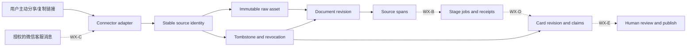

# 微信增量入库、证据管线与卡片工厂计划（2026-10-03）

> 本文定义微信相关采集从“尽量拿到正文”升级为“可增量、可追溯、可重放、可审阅”的工程路径。`WX-0`–`WX-E` 是工作包，不是另一条产品版本号；它们必须挂靠 [2.12.0–2.21.0 权威工程计划](./workbuddy-integration-plan-2026-09-18.md) 的权限、队列、产物修订、审阅和租户门禁。
>
> 截至 2026-10-03，分支 `codex/wechat-evidence-pipeline-v2` 只实现了 `WX-0` 和 `WX-A` 的基础。代码、迁移和本地测试存在不等于已合入、已发布、生产可用或客户验收。`WX-B`–`WX-E` 仍为 `planned`。

## 1. 结论与证据边界

当前没有找到微信官方提供的、可枚举个人微信收藏或个人订阅阅读流的增量 API。公众号素材 API 管理的是调用方有权管理的自有公众号素材；企业微信会话存档和微信客服 API 面向企业已配置、已授权的通信场景，都不等于读取个人微信收藏。

因此，后续版本采用两条明确分开的入口：

1. **个人收藏/阅读流**：继续使用用户主动分享、复制链接、浏览器/桌面采集器、文件上传或明确授权的本机适配器。它们都必须显示来源和失败状态，不能包装成“官方自动同步”。
2. **企业微信微信客服**：规划为用户主动把内容发送到企业已配置的客服账号后，由官方消息接口增量读取。该方向需要企业主体、应用权限、回调验签、密钥管理、数据范围确认和真实环境 PoC；当前未完成。

本计划不包含绕过登录、验证码、付费墙、客户端签名或平台访问控制，也不把第三方 `wechat-cli`、UI 自动化或 reader proxy 称为微信官方连接器。

## 2. 工作包与主版本映射

| 工作包 | 挂靠版本 | 当前状态 | 本分支范围 | 完成仍需 |
| --- | --- | --- | --- | --- |
| `WX-0` 采集安全与真实降级 | 与 `2.12.0` 并行 | `local_implementation` 基础 | TLS 不再静默降级；reader proxy 默认关闭；访问受限进入 `needs_body`；原始响应与清洗正文分离；微信持久化 URL 去除会话参数；模型 fallback 可见 | 浏览器/真实微信样本人工复核、合并与 CI；不替代 2.12 PR-B/PR-C |
| `WX-A` Source Envelope 与证据账本 | `2.13.0` | `local_implementation` 基础 | 稳定来源身份、raw asset、document revision、source span、transform receipt；真实入口按 raw 变化建 revision；24 小时可配置重采 checkpoint；幂等写入和 tombstone；`0041` 扩展迁移 | 通用 connector cursor/lease checkpoint、历史受控回填、API/运维视图、完整性能和恢复证据 |
| `WX-B` 分阶段作业与失效传播 | `2.14.0` | `planned` | 无 | stage job、租约、重试/dead-letter、依赖图、parser/model 变更后的选择性重算 |
| `WX-C` 官方/授权连接器 | `2.15.0` | `planned` | 无企业微信实时连接器 | 微信客服回调与 `next_cursor` checkpoint、`msgid` 去重、媒体下载、撤回/删除传播、权限撤销、真实环境 PoC |
| `WX-D` Card Factory v2 | `2.16.0` | `planned` | 仅有 `card-v2-compat-1` 兼容元数据前置，不构成 WX-D 完成 | 严格 card/claim/evidence schema、不可变卡片 revision、claim-to-span 校验、diff/rollback |
| `WX-E` 审阅、租户与评测 | `2.17.0`、`2.19.0`、`2.20.0` | `planned` | 无 | Review Inbox、租户 ACL/保留策略、固定解析/卡片 benchmark、人工接受证据；移动只读可在 2.18 延伸 |

`WX-0`/`WX-A` 的并行开发不能把 `2.12.0` 标为完成。当前主线下一步仍是把 WorkBuddy webhook、`POST /api/tasks` 和 Focus Assistant 收敛到统一的 proposal、approval 和 callback policy。

## 3. 目标架构



核心不变量：

- `Item` 继续作为兼容现有 UI/API 的可变投影；来源、原始内容、解析修订和转换回执进入独立账本。
- 同一来源身份反复出现时更新 `last_seen_at`，不创建第二个 source item。
- 原始字节/文本按哈希去重且不可覆盖；清洗、解析或模型变化生成新 revision/receipt，不改写旧证据。
- 正文未获取、schema fallback、模型 fallback 和来源撤回都是显式状态，不能落成看似成功的卡片。
- 卡片发布必须引用可定位的 source spans；只有文档级来源、没有 claim-to-span 映射时保持 `unverified_document_scope`。

## 4. 当前分支的可审计实现

### 4.1 采集安全与失败状态（WX-0）

| 行为 | 当前实现 | 证据边界 |
| --- | --- | --- |
| TLS | `content_extractor.py`、`wechat_url_resolver.py` 和研究搜索路径不再因证书错误自动切到未验证 TLS | 不等于目标站可访问；证书问题会显式失败 |
| reader proxy | `READER_PROXY_ENABLED=false`，仅显式开启后才向外部 reader 发送目标 URL | 开启会向第三方披露目标 URL，需单独评估和告知 |
| URL 隐私与出站边界 | fetch URL 只在当前抓取调用中临时使用；微信持久化 canonical URL 只保留 `__biz/mid/idx/sn/chksm`，Item、attempt、evidence、桌面 state/report/log 均使用该身份。Python 直连关闭环境代理，并在发送 HTTP/TLS 数据前校验实际 socket peer；Chromium 启动前固定已验证 hostname 到公网 IP，以 `MAP * ^NOTFOUND` 拒绝其他解析，在请求层只允许已固定的 HTTP(S) host；采集页禁用目标页面 JavaScript，并在每个新 document/frame 前冻结 WebRTC 与 popup 入口 | 用户自行维护的 source 文件仍应避免写入会话凭据；浏览器 allowlist 和禁用目标脚本会阻断跨 host redirect/动态渲染资源并可能降低抽取完整度；本地应用防线不能替代生产环境 egress policy |
| 微信访问受限 | 验证/授权壳不再生成“成功正文”；所有正文路径失败时写 `status=needs_body` 和 `content_acquisition_status=access_limited|needs_body` | `needs_body` 是等待用户补正文或重试，不是已解析成功 |
| raw/clean 分离 | `CollectorRawAsset.raw_text` 保存本次提交/抓取的正文，瞬时 fetch URL 不作为 raw asset 内容传入，connector 生成的链接文本使用 canonical URL；URL/plugin 的 `Item.raw_content` 与 `clean_content` 只保存受控投影；列表 API 保留原字段但将 raw/详细 receipt 返回为 `null`/空列表 | 旧历史记录若已被覆盖，`0041` 不伪造原始内容；历史 Item 投影中的签名 URL 会被凭据清洗，不能称逐字节原始副本 |
| 响应大小 | 直接抓取和 reader 路径读取 `max_bytes + 1`，超限显式返回 `content_too_large` | 超限内容不静默截断成“已获取正文” |
| LLM 降级 | 摘要、标签、评分保存 provider/model/schema/output/usage 等 receipt；schema fallback 写 `status=degraded` | mock/runtime fallback 可显式标记，但不自动等同模型错误 |
| 收藏批次 | `needs_body` 和 `degraded` 被纳入待处理/失败列表；全量缺正文的批次返回 `needs_body`；同 canonical/标题但临时 token 更新的 deferred 记录仍会排队刷新 | 临时 fetch URL 不持久化；DB 提交后、后台任务执行前若进程退出，只能用 canonical URL 补偿重试并可能进入 `needs_body`；状态变化不证明真实微信端采集稳定性 |

### 4.2 Source Envelope（WX-A）

Alembic `20261003_0041` 以 expand-only 方式新增以下表，并为 raw asset、revision、span、transform receipt 建立 SQLite/PostgreSQL retained-immutable 防护：保留期间禁止 UPDATE；父级隐私删除仍可级联清除，删除 revision 时同步清理 source 的 current pointer。迁移收养既有同名表前校验完整列、类型、nullable、default、PK、FK 和 UNIQUE；不兼容非空表拒绝升级，PostgreSQL 检查/重建前获取排他表锁。

| 表 | 唯一性/职责 |
| --- | --- |
| `collector_source_items` | `(user_id, connector, account_scope, native_item_id)` 唯一；保存稳定来源身份、当前 revision key、first/last seen 和 tombstone |
| `collector_raw_assets` | `(user_id, sha256)` 唯一；保存原始文本/媒体描述、大小、mime 和存储 URI |
| `collector_document_revisions` | `(source_item_id, revision_key)` 唯一；revision key 绑定 native version、raw hash、normalized hash 和 parser fingerprint |
| `collector_source_spans` | `(revision_id, span_key)` 唯一；保留文本 hash，以及预留的页码、bbox、DOM selector、字符区间 |
| `collector_transform_receipts` | `(user_id, revision_id, stage, input_hash, stage_fingerprint, output_hash)` 唯一；保存 provider/model、schema fingerprint、usage 和诊断 |

当前 `wechat_favorites` 投影映射为 connector `wechat_favorites_history`。有 connector-native ID 时必须直接使用；当前没有 native ID 的 URL 采集只以 canonical URL hash 作为稳定身份，连 URL 也没有时才退到本地 item ID。这个 fallback 不能代替未来微信客服的 `msgid` 或其他官方 ID。

`0041` 还用数据库 trigger 校验 source/item、revision/raw/item 和 receipt/revision/item 的用户归属，阻止跨用户证据链。它不回填旧记录的“原始正文”，也不在 downgrade 中删除证据表。历史数据若缺原始资产，只能标为 legacy projection 后逐批重抓或人工补录，不能用当前清洗正文冒充历史 raw capture。

### 4.3 卡片兼容前置

重新处理 Item 时，现有知识条目会更新内容和 metadata，而不是静默返回陈旧卡片。`card-v2-compat-1` 记录 source revision、span IDs、key points、推荐理由、内容密度、新颖度和生成回执，并把 claim 级状态明确写为 `unverified_document_scope`。

这只是为 `WX-D` 准备的兼容层。它没有 claim 实体、逐条证据范围校验、不可变 card revision、接受/拒绝状态或 revision diff，不能称为 Card Factory v2。

## 5. 增量语义

### 5.1 捕获幂等

1. connector 先用 `connector + account_scope + native_item_id` 查 source item。
2. raw payload 计算 SHA-256，同一用户下相同 raw 复用 asset。
3. `native_version + raw_sha256 + normalized_sha256 + parser_fingerprint` 生成 revision key。
4. 同一 key 重放返回原 revision；raw 或 parser 指纹变化才创建新 revision。
5. transform 以 stage、输入 hash 和 stage fingerprint 去重；provider/model/prompt/schema 变化会产生新的 stage fingerprint。
6. plugin 已有 URL 再提交时会比较原始 payload：未变化只更新 seen 状态，变化则创建 revision 并按请求决定是否重处理。URL/browser 路径通过 `refresh=true` 显式重抓；桌面采集器的 `seen_links` 默认 24 小时到期，可用 `--refresh-seen-hours` 或 `refresh_seen_hours` 调整，`0` 表示每轮均检查。

### 5.2 删除、撤回与失效

来源撤回写 tombstone 和原因，不物理覆盖证据。`WX-B` 需要补充从 source/revision 到 span、transform 和 card revision 的失效传播：

- 已发布卡片保留审计索引，但 UI 明确标记来源已撤回或权限已失效。
- 未发布卡片进入 `review_required`/`hold`，不继续自动传播。
- 权限撤销后停止新拉取，并按租户保留策略处理受保护内容；不得以“回滚”为由重新导入已批准擦除的数据。

### 5.3 checkpoint（WX-B/WX-C，未实现）

新增 `ConnectorCheckpoint`，至少包含 connector、account scope、partition、cursor/offset、last native ID、lease owner/expiry、success/error time 和 config digest。checkpoint 只能在一批 source/revision/receipt 同一事务提交后前移；崩溃重放依赖 native ID 幂等，不承诺外部系统 exactly-once。

## 6. 解析路由与分阶段作业（WX-B）

规划的固定阶段为 `capture → parse → normalize → segment → summarize/tag/score → card → review`。每个 stage job 保存输入 revision、实现/模型指纹、依赖 digest、attempt、租约、输出引用和固定错误码。首版复用现有 `ResearchJob` 的单进程 SQLite 租约/恢复模式；不能称为分布式 durable queue。

解析路由按格式确定，不让模型自由选择：

| 输入 | 默认/候选路径 | 接入条件 |
| --- | --- | --- |
| 微信 HTML | 现有 `#js_content`/确定性 HTML 提取为默认；Trafilatura 仅作为 shadow candidate | 中文正文、噪声、表格、访问壳和延迟固定样本通过 |
| 普通网页 | 现有 deterministic extractor；候选 parser 旁路比较 | canonical URL、raw 保存、失败分类和 robots/授权边界齐全 |
| PDF/DOCX/PPTX/XLSX | Docling 作为候选 shadow parser；现有原生解析保留 fallback | 固定模型/代码 revision、许可证、资源和中文样本评测通过 |
| 图片/扫描件 | 现有 macOS Vision/OpenAI-compatible 路径；PaddleOCR/其他本地 OCR 仅作候选 | 坐标、置信度、语言、资源占用和隐私评测通过 |

候选库未因写入本计划而完成安装、集成或安全批准。parser 升级先 shadow 产出新 revision，比较通过后再切默认；旧 revision 永不覆盖。

## 7. 企业微信微信客服连接器（WX-C）

计划使用企业微信“微信客服”消息读取接口：回调只触发同步，具体消息通过 `sync_msg` 拉取；保存 `next_cursor`，以 `has_more` 判断是否继续，不能因某一页 `msg_list` 为空就停止。`msgid` 作为 native item ID，`open_kfid` 进入 account scope，文本/链接/媒体分别建立 raw asset；撤回、账号关闭或权限撤销写 tombstone/状态事件。

实施门禁：

- `ANTI_FOMO_WECOM_KF=0` 默认关闭；无企业配置时不影响现有个人采集路径。
- callback 必须完成官方签名校验和解密；secret/token/密钥只进入 secret store 或环境配置，禁止进入 evidence 表、日志和卡片。
- checkpoint、source/revision 和 ack 状态在事务边界内一致；429/5xx 有限退避，未知提交状态进入 reconcile。
- 媒体先校验类型/大小/hash，再进入隔离存储；下载失败保留消息 envelope 并显示 `media_pending`。
- 只读取该企业明确授权、通过 API 管理的客服账号和时间窗口；数据主体、保留期、导出/删除流程需在 PoC 前确认。
- PoC 必须覆盖首次同步、cursor 续拉、空页但 `has_more=1`、重复回调、进程重启、媒体失败、撤回、权限撤销和密钥轮换。

官方文档当前描述的是企业微信微信客服消息，不是个人微信收藏；即使 PoC 成功，也只能称“用户主动发送到企业微信客服后的增量收件箱”。

## 8. Card Factory v2（WX-D）

目标对象分为：

- `CardRevision`：card key、parent revision、source revision set、generator/schema fingerprint、状态和 artifact digest。
- `CardClaim`：原子 claim、类型、置信区间/证据状态、推断标记。
- `ClaimEvidenceLink`：claim ID、source span ID、关系（support/contradict/context）、定位和校验状态。
- `CardDecision`：reviewer、expected revision、accept/reject/return、reason 和时间。

生成规则：

1. 没有正文或 parser/LLM fallback 时最多生成 `draft/degraded`，不能进入 publish-ready。
2. 每个可发布事实 claim 至少绑定一个仍有效的 span；推断必须单独标识，不得伪装为来源事实。
3. source revision、parser、prompt/schema 或模型 profile 变化时生成新 card revision；已接受版本不原地覆盖。
4. 卡片 diff 同时显示文本变化、来源增删、claim 证据变化和 runtime receipt 变化。
5. 缺证据、来源 tombstone、跨租户 span、digest 不一致均进入 HOLD。

## 9. 审阅、租户和固定评测（WX-E）

- `2.17`：Review Inbox 对 card revision 执行逐条接受/拒绝/退回；批量操作逐项回执，AI 建议仅保存 diff。
- `2.19`：connector account、raw asset、revision、span、card 和 review 全部绑定租户/项目 ACL；权限撤销和保留策略有恢复演练。
- `2.20`：固定脱敏集评测 source identity、解析、分段、claim 抽取、evidence link 和卡片可用性；只报告 `synthetic_benchmark`/`human_acceptance`，不能推导客户或生产指标。

最低验收指标：

| 指标 | 目标 | 证据 |
| --- | --- | --- |
| 同 native ID 重放新增 source item | 0 | 并发/重启 fixture |
| 同 raw + parser 重放新增 revision | 0 | service idempotency test |
| access-block 页面进入 `ready` | 0 | 固定验证/授权壳样本 |
| 新捕获 lineage 完整率 | 100% | source → raw → revision → span/诊断查询 |
| 微信客服固定 1,000 消息重放重复 source | 0（planned） | fake server + cursor/restart harness |
| publish-ready factual claims 缺有效 span | 0（planned） | claim validator + negative fixtures |
| 跨租户读取/引用 | 0（planned） | 三租户权限负例 |

真实微信可访问率、OCR 准确率、卡片采纳率和处理延迟必须先记录样本、环境和分位数，再设发布门槛；本文不把尚未测量的数据写成 SLA。

## 10. 迁移、回滚与发布顺序

1. `0041` 只扩展表和 Item 字段；部署时停止证据表写入并备份数据库，部署后检查 Alembic head、表/索引/trigger、`PRAGMA integrity_check` 和 `foreign_key_check`。SQLite 全历史与 PostgreSQL 的 0040→0041 路径分别验证；PostgreSQL 空库全历史首先受旧 `0011` 的 64 字符外键名 `fk_research_report_versions_knowledge_entry_id_knowledge_entries` 阻断，源码审计还识别到后续 `0033` 的 64 字符唯一约束名 `uq_product_strategy_artifact_acceptance_initialization_event_key`。两者均与本次已验证的 0040→0041 路径无关，修复前不能宣称 PostgreSQL 空库全历史迁移通过。
2. 先启用 WX-0 状态语义和 WX-A 双写，保持现有 Item API；出现问题时停止新双写，证据表保留只读，不用破坏性 downgrade。
3. 历史回填另开可暂停任务：只为仍可证明来源的记录创建 `legacy_projection`，缺 raw 不伪造；每批有 cursor、数量和失败清单。
4. WX-B job、WX-C connector、WX-D card 和 WX-E review/tenant 各自使用默认关闭的 feature flag，逐层开启；关闭下游 flag 不删除已生成 revision/receipt。
5. 合并前完成迁移测试、SQLite/PostgreSQL 兼容检查、失败注入、全量后端/前端回归和文档复核。合并、CI、发布、PoC、人工接受与客户接受分别记录，不能合并表述。

本分支的定向验证入口：

```bash
backend/.venv311/bin/pytest -q \
  backend/tests/test_db_types.py \
  backend/tests/test_collector_evidence_pipeline.py \
  backend/tests/test_collector_evidence_migration.py \
  backend/tests/test_collector_ingest_revision_wiring.py \
  backend/tests/test_collector_review_statuses.py \
  backend/tests/test_access_limited_fallback.py \
  backend/tests/test_browser_content_extractor_chain.py \
  backend/tests/test_item_processor_display_title.py \
  backend/tests/test_knowledge_service.py \
  backend/tests/test_multiformat_collector_service.py \
  backend/tests/test_public_url_guard.py \
  backend/tests/test_source_url_privacy.py \
  backend/tests/test_sqlite_compat.py \
  backend/tests/test_task_envelope_migration.py
npm run collector:state:test
```

通过定向测试只能证明相应本地 fixture；仍需全量检查、CI、真实来源人工复核和相应外部 PoC。

## 11. 参考边界

### 微信/企业微信官方能力

- [企业微信：接收微信客服消息和事件](https://developer.work.weixin.qq.com/document/path/94670)：描述 callback、`sync_msg`、`next_cursor`、`has_more` 和 `msgid`；仅用于未来 WX-C 设计依据。
- [微信公众号：获取永久素材列表](https://developers.weixin.qq.com/doc/subscription/api/material/permanent/api_batchgetmaterial.html)：面向有权管理的公众号素材，不是个人收藏或第三方公众号订阅流。
- [企业微信：获取会话内容](https://open.work.weixin.qq.com/api/doc/90000/90135/91774)：企业会话存档边界；是否可用取决于企业许可、配置和合规要求。

### 解析候选

- [Docling](https://github.com/docling-project/docling)
- [Trafilatura](https://github.com/adbar/trafilatura)
- [PaddleOCR](https://github.com/PaddlePaddle/PaddleOCR)
- [Playwright actionability](https://playwright.dev/docs/actionability)

这些链接证明候选能力或官方接口定义，不证明 Anti-FOMO 已集成、已获授权、达到准确率目标或可生产使用。
